## 概述

Algolia 提供强大的搜索功能，相比 VuePress 内置搜索具有以下优势：
- ⚡ **更快的搜索速度** - 毫秒级响应
- 🎯 **更精准的搜索结果** - 智能匹配和排序
- ✨ **搜索高亮** - 关键词高亮显示
- 📝 **搜索建议** - 自动补全和搜索历史
- 🌍 **多语言支持** - 更好的中文搜索体验


## 申请免费的 DocSearch（推荐）

**DocSearch** 是 Algolia 为开源项目和技术文档网站提供的完全免费服务。

### 第一步：准备工作

在申请之前，请确保：
1. ✅ 网站已部署并可以公开访问（如 Vercel、GitHub Pages）
2. ✅ 网站域名稳定（建议使用自定义域名）
3. ✅ 网站内容质量良好（技术文档或博客）

### 第二步：提交申请

1. **访问申请页面**
   - 打开：https://docsearch.algolia.com/apply/
   - 页面会显示申请表单，**Name中输入你的应用名**：
   - 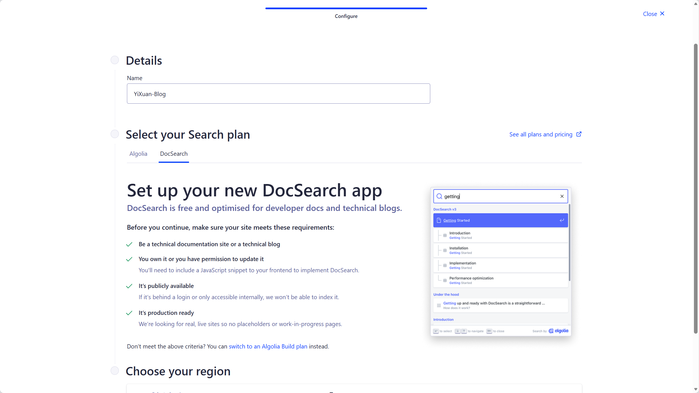
   - 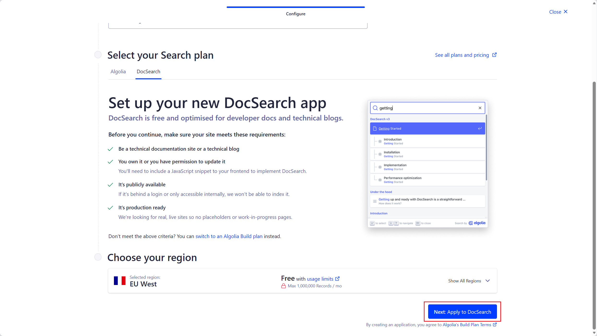
   
2. **填写申请信息**
   
   **必填项：**
   - **网站 URL**：填写你的网站完整地址（例如：`https://yixuan.cyou`）
     
     - ⚠️ 必须是 HTTPS
     - ⚠️ 必须是公开可访问的
     - 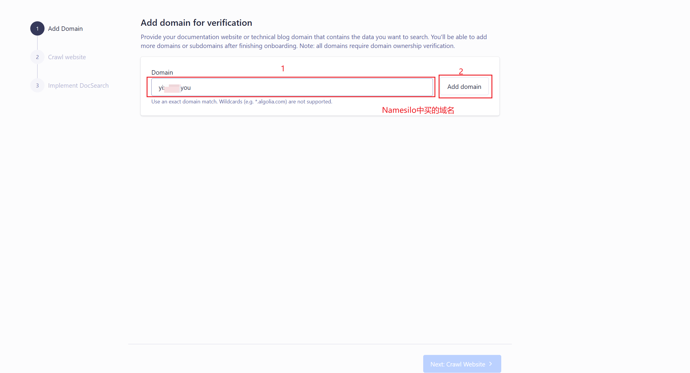
     - 域名检测成功下点击Next Crawl Website：
     - 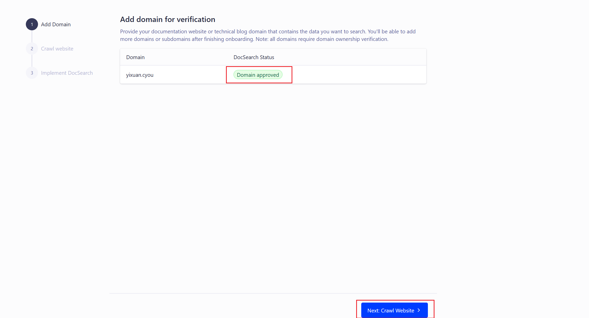
     - 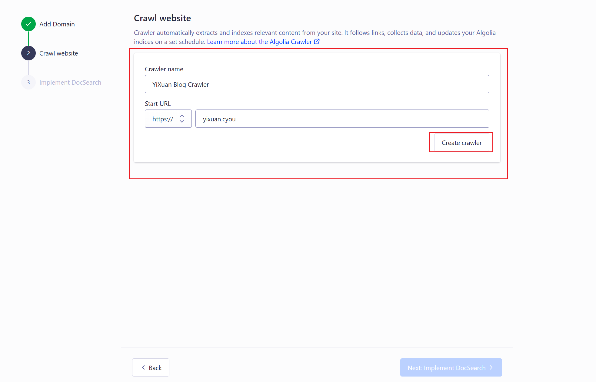
     - > 上述如果出现
       >
       > No content found at your start URL (https://yixuan.cyou)
       >
       > We couldn't create any records because no content was detected at your start URL. Please double-check that the URL is correct and update it if needed. If you believe this is an error, contact our DocSearch team on Discord. 
     - 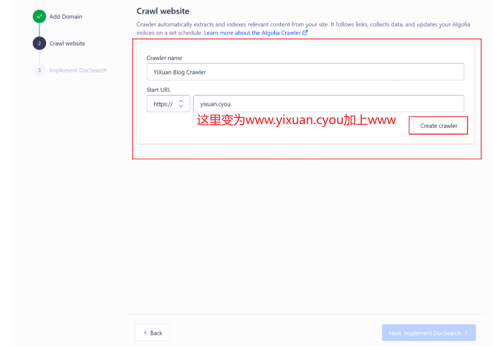
     - 等待爬取
     - 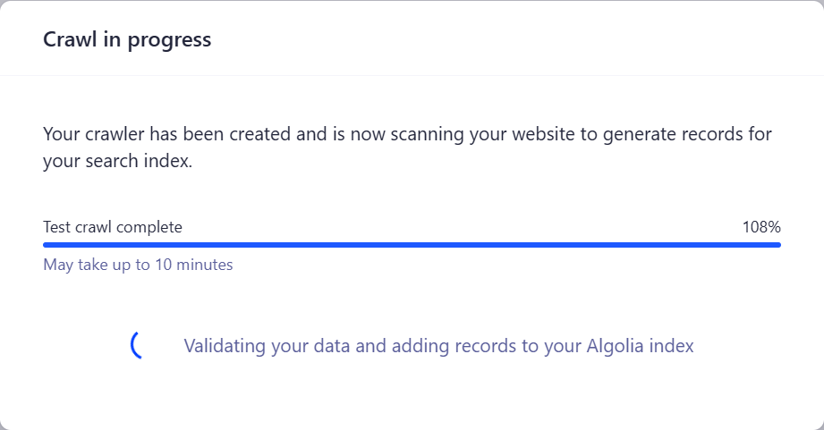
     - 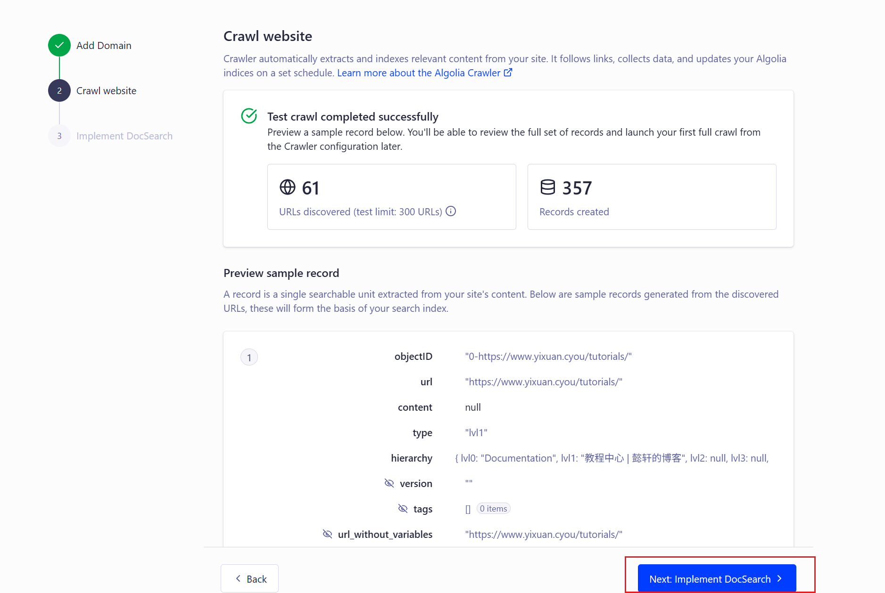
     - 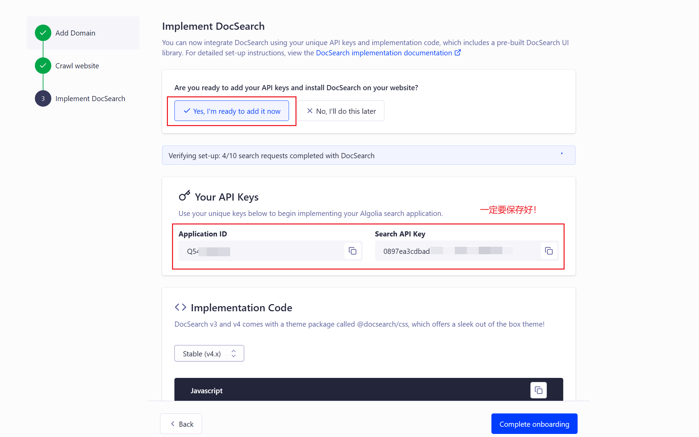
     - 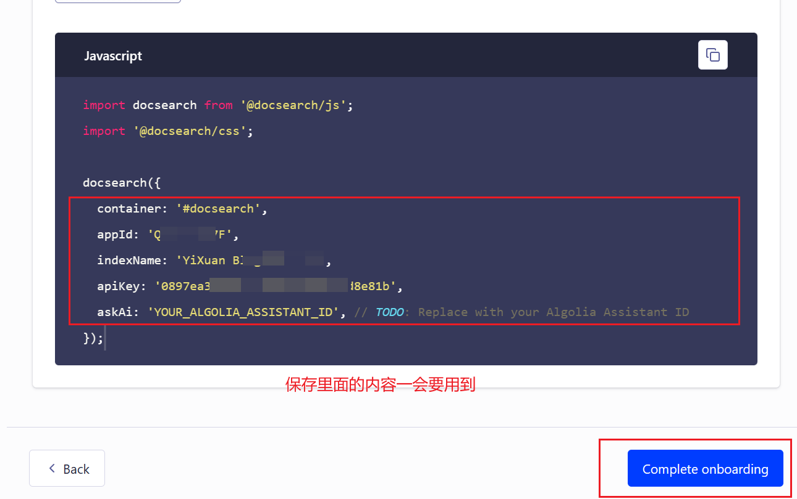
     - 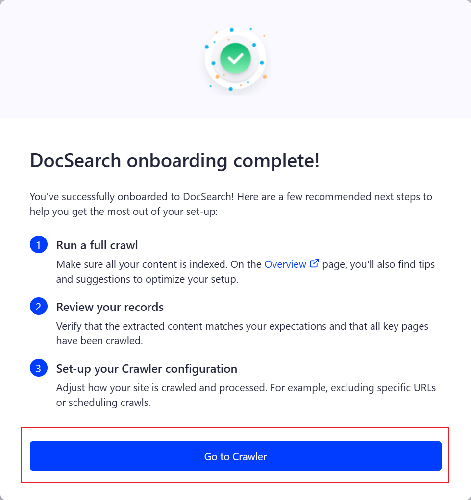
   
3. **提交申请**
   
   - 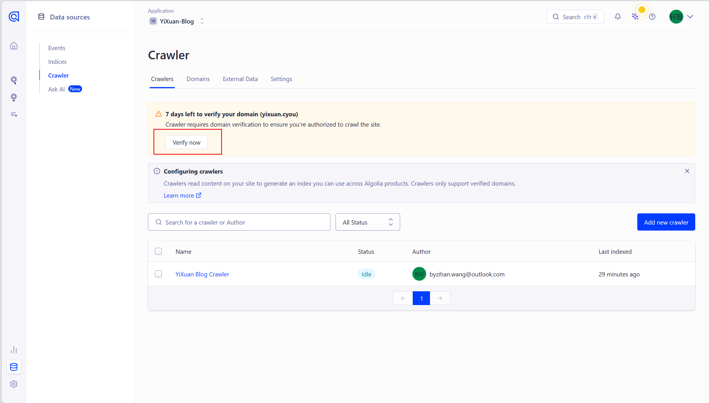
   - 将代码中请求头于上述代码配置保持一致，保存成功后重新上传代码到GitHub，等待Vercel正确部署：
   - 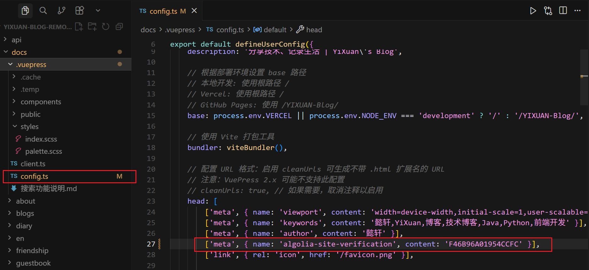
   - 点击Verify Now
   - 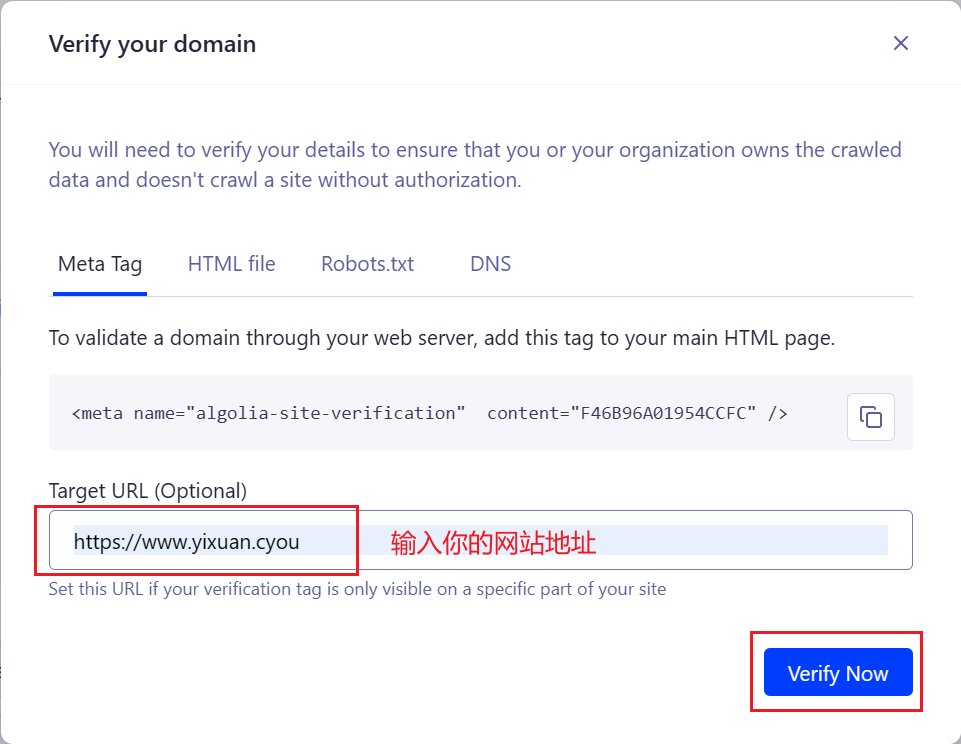
   - 显示下述即配置成功
   - 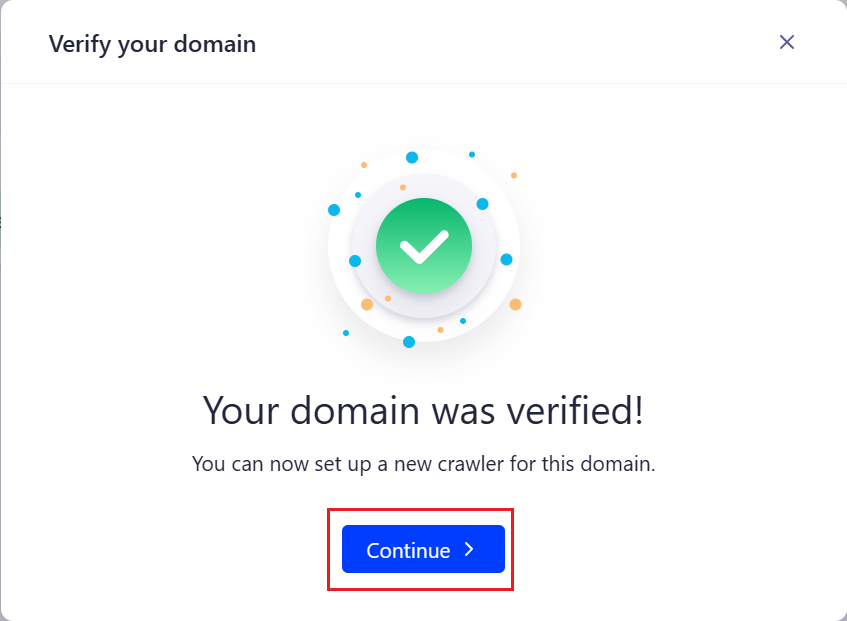
   
   

### 第三步：

#### 步骤 1：编辑 Crawler 配置

1. 在 Algolia Dashboard，左侧菜单点击 **"Crawler"**

2. ```
   https://dashboard.algolia.com/apps/...你的ID/crawler
   ```

3. 找到 **"YiXuan Blog Crawler"**

4. 点击进入配置页面

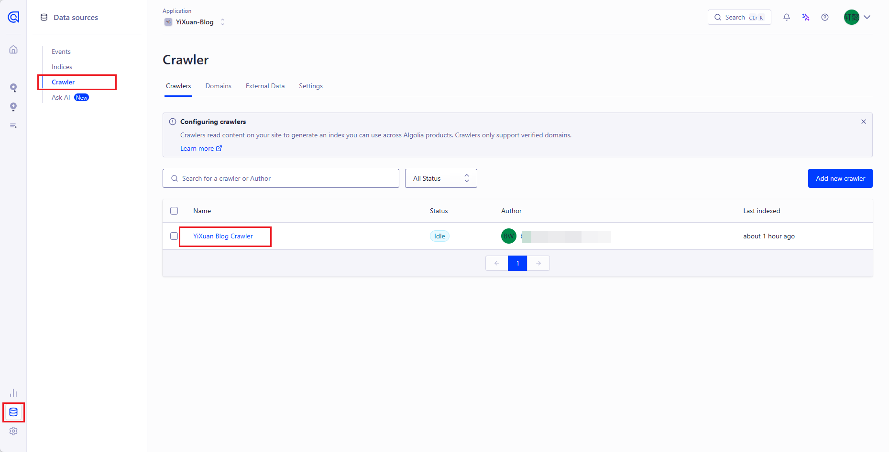


#### 步骤 2：配置内容选择器

找到 **"Editor"** 

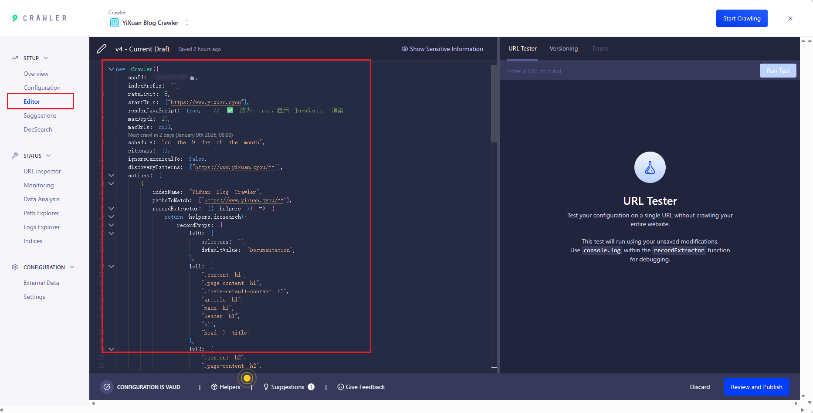

由于你的网站是 VuePress，需要配置合适的选择器来提取内容。建议添加以下配置：

**需要替换的敏感信息**

| 配置项                  | 说明                                     | 获取位置                             |
| :---------------------- | :--------------------------------------- | :----------------------------------- |
| YOUR_APP_ID             | Algolia Application ID                   | Dashboard → Application → API Keys   |
| YOUR_ADMIN_API_KEY      | Admin API Key（仅在 Crawler 配置中使用） | Dashboard → API Keys → Admin API Key |
| YOUR_INDEX_NAME         | 索引名称                                 | Dashboard → Indices → 你的索引名称   |
| https://your-domain.com | 你的网站域名                             | 替换为实际域名                       |

```json
new Crawler({
  // ========================================
  // 基础配置
  // ========================================
  appId: "YOUR_APP_ID",              // Algolia Application ID
  apiKey: "YOUR_ADMIN_API_KEY",      // Admin API Key（仅在 Crawler 配置中使用，不要暴露在前端）
  indexPrefix: "",                    // 索引名称前缀（可选，通常留空）
  
  // ========================================
  // 爬取配置
  // ========================================
  startUrls: ["https://your-domain.com"],  // 起始 URL，从这些页面开始爬取
  discoveryPatterns: ["https://your-domain.com/**"],  // URL 发现模式，** 表示匹配所有路径
  renderJavaScript: true,             // ⚠️ 重要：启用 JavaScript 渲染（SPA 网站必须为 true）
  maxDepth: 10,                       // 最大爬取深度
  maxUrls: null,                      // 最大 URL 数量限制（null 表示无限制）
  rateLimit: 8,                       // 爬取速率限制（每秒请求数）
  
  // ========================================
  // 爬取计划
  // ========================================
  schedule: "on the 9 day of the month",  // 定期爬取计划（Cron 格式）
  
  // ========================================
  // Sitemap 配置
  // ========================================
  sitemaps: [],                       // Sitemap URL 列表（可选，如 ["https://your-domain.com/sitemap.xml"]）
  ignoreCanonicalTo: false,           // 是否忽略 canonical 标签
  
  // ========================================
  // 内容提取配置
  // ========================================
  actions: [
    {
      indexName: "YOUR_INDEX_NAME",   // 目标索引名称
      pathsToMatch: ["https://your-domain.com/**"],  // 匹配这些路径的页面
      recordExtractor: ({ helpers }) => {
        return helpers.docsearch({
          recordProps: {
            // 标题层级选择器（h1-h6）
            lvl0: {
              selectors: "",           // 通常为空
              defaultValue: "Documentation",  // 默认值
            },
            lvl1: [
              ".content h1",          // VuePress 内容容器
              ".page-content h1",
              ".theme-default-content h1",
              "article h1",
              "main h1",
              "header h1",
              "h1",
              "head > title"
            ],
            lvl2: [
              ".content h2",
              ".page-content h2",
              ".theme-default-content h2",
              "article h2",
              "main h2",
              "h2"
            ],
            lvl3: [
              ".content h3",
              ".page-content h3",
              ".theme-default-content h3",
              "article h3",
              "main h3",
              "h3"
            ],
            lvl4: [
              ".content h4",
              ".page-content h4",
              ".theme-default-content h4",
              "article h4",
              "main h4",
              "h4"
            ],
            lvl5: [
              ".content h5",
              ".page-content h5",
              ".theme-default-content h5",
              "article h5",
              "main h5",
              "h5"
            ],
            lvl6: [
              ".content h6",
              ".page-content h6",
              ".theme-default-content h6",
              "article h6",
              "main h6",
              "h6"
            ],
            // 内容文本选择器（段落和列表）
            content: [
              ".content p, .content li",
              ".page-content p, .page-content li",
              ".theme-default-content p, .theme-default-content li",
              "article p, article li",
              "main p, main li",
              ".main-content p, .main-content li",
              "p, li"
            ],
          },
          aggregateContent: true,      // 聚合内容
          recordVersion: "v3",         // 记录版本
        });
      },
    },
  ],
  
  // ========================================
  // 安全设置
  // ========================================
  safetyChecks: {
    beforeIndexPublishing: {
      maxLostRecordsPercentage: 30  // 发布前检查：丢失记录百分比阈值
    }
  },
  
  // ========================================
  // 索引初始设置
  // ========================================
  initialIndexSettings: {
    "YOUR_INDEX_NAME": {
      // 用于过滤的属性
      attributesForFaceting: ["type", "lang"],
      
      // 返回的属性
      attributesToRetrieve: [
        "hierarchy",
        "content",
        "anchor",
        "url",
        "url_without_anchor",
        "type",
      ],
      
      // 高亮属性
      attributesToHighlight: ["hierarchy", "content"],
      
      // 片段属性
      attributesToSnippet: ["content:10"],
      
      // 驼峰命名的属性
      camelCaseAttributes: ["hierarchy", "content"],
      
      // 可搜索属性（按优先级排序）
      searchableAttributes: [
        "unordered(hierarchy.lvl0)",
        "unordered(hierarchy.lvl1)",
        "unordered(hierarchy.lvl2)",
        "unordered(hierarchy.lvl3)",
        "unordered(hierarchy.lvl4)",
        "unordered(hierarchy.lvl5)",
        "unordered(hierarchy.lvl6)",
        "content",
      ],
      
      // 去重设置
      distinct: true,
      attributeForDistinct: "url",
      
      // 自定义排序
      customRanking: [
        "desc(weight.pageRank)",    // 按页面排名降序
        "desc(weight.level)",        // 按层级降序
        "asc(weight.position)",      // 按位置升序
      ],
      
      // 排序规则
      ranking: [
        "words",
        "filters",
        "typo",
        "attribute",
        "proximity",
        "exact",
        "custom",
      ],
      
      // 高亮标签
      highlightPreTag: '<span class="algolia-docsearch-suggestion--highlight">',
      highlightPostTag: "</span>",
      
      // 拼写容错设置
      minWordSizefor1Typo: 3,        // 最小单词长度（1 个拼写错误）
      minWordSizefor2Typos: 7,       // 最小单词长度（2 个拼写错误）
      allowTyposOnNumericTokens: false,  // 数字令牌是否允许拼写错误
      
      // 其他设置
      minProximity: 1,               // 最小邻近度
      ignorePlurals: true,           // 忽略复数形式
      advancedSyntax: true,          // 启用高级语法
      attributeCriteriaComputedByMinProximity: true,
      removeWordsIfNoResults: "allOptional",  // 无结果时移除单词的策略
    },
  },
});
```

开始爬取：


如图所示就爬取成功：

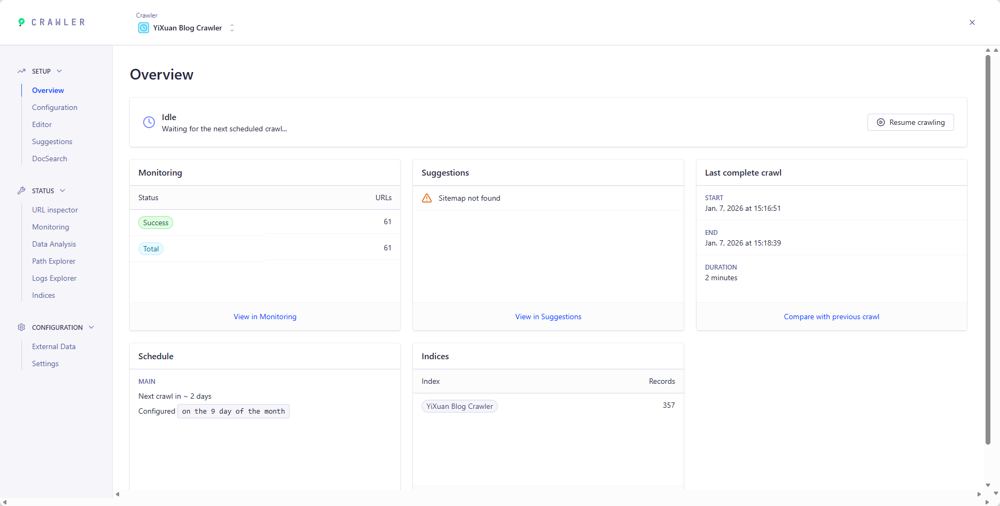

### 第四步：配置到项目

收到配置邮件后，按照以下步骤配置：

1. **打开配置文件**
   - 编辑 `docs/.vuepress/config.ts`

2. **找到 Algolia 配置位置**
   - 在 `theme: recoTheme({...})` 配置块中
   - 当前配置在第 164-174 行（已被注释）

3. **取消注释并填写配置**
   
   找到这段代码：
   ```typescript:164:174:docs/.vuepress/config.ts
   // Algolia 搜索配置（已禁用，使用主题内置搜索）
   // algolia: {
   //     appId: 'MLKOH1MKDT',
   //     apiKey: '5af2979d2d290ce4e9247d7f89549455',
   //     indexName: '懿轩的博客_pages',
   //     // 可选：高级配置
   //     algoliaOptions: { 
   //         'facetFilters': ["lang:zh-CN"] 
   //     },
   //     debug: false // 调试时可设置为 true
   // },
   ```
   
   修改为（将邮件中的值替换进去）：
   ```typescript
   // Algolia 搜索配置
   algolia: {
       appId: 'YOUR_APP_ID',        // 替换为邮件中的 appId
       apiKey: 'YOUR_API_KEY',      // 替换为邮件中的 apiKey（Search-Only API Key）
       indexName: 'YOUR_INDEX_NAME', // 替换为邮件中的 indexName
       // 可选：高级配置
       algoliaOptions: { 
           'facetFilters': ["lang:zh-CN"] // 中文网站使用此配置
       },
       debug: false // 调试时可设置为 true，生产环境建议 false
   },
   ```

4. **保存文件**

### 第五步：等待索引建立

- ⏱️ **索引时间**：DocSearch 会在审核通过后的 1-3 天内首次爬取网站
- 🔄 **更新频率**：之后每周自动更新一次
- 📊 **查看状态**：可以在 Algolia Dashboard 查看索引状态

---

