# Namesilo + Cloudflare 域名配置完整指南

> 本指南将帮助你从零开始配置域名，包括在 Namesilo 购买域名、将域名转移到 Cloudflare 进行 DNS 管理，以及配置 DNS 记录指向你的网站。

## 📋 目录

- [什么是 Namesilo 和 Cloudflare](#什么是-namesilo-和-cloudflare)
- [快速开始](#快速开始)
- [第一步：在 Namesilo 购买域名](#第一步在-namesilo-购买域名)
- [第二步：注册 Cloudflare 账号](#第二步注册-cloudflare-账号)
- [第三步：在 Cloudflare 添加域名](#第三步在-cloudflare-添加域名)
- [第四步：修改 Namesilo DNS 服务器](#第四步修改-namesilo-dns-服务器)
- [第五步：配置 DNS 记录](#第五步配置-dns-记录)
- [第六步：配置 SSL/TLS](#第六步配置-ssltls)
- [第七步：配置 Vercel 自定义域名](#第七步配置-vercel-自定义域名)
- [验证配置](#验证配置)
- [常见问题](#常见问题)
- [注意事项](#注意事项)
- [总结](#总结)

---

## 什么是 Namesilo 和 Cloudflare

### Namesilo

Namesilo 是一家知名的域名注册商，提供以下优势：

- ✅ **价格实惠**：域名价格相对较低，常年有优惠
- ✅ **免费隐私保护**：注册域名免费提供 WHOIS 隐私保护
- ✅ **无隐藏费用**：价格透明，续费价格稳定
- ✅ **简单易用**：控制面板简洁，操作方便
- ✅ **支持中文**：支持中文界面和客服

### Cloudflare

Cloudflare 是全球领先的 CDN 和安全服务提供商，提供以下优势：

- ✅ **免费 CDN**：全球 CDN 加速，提升网站访问速度
- ✅ **免费 SSL**：自动提供免费的 SSL 证书（HTTPS）
- ✅ **DNS 管理**：强大的 DNS 管理功能
- ✅ **安全防护**：DDoS 防护、WAF 等安全功能
- ✅ **免费使用**：基础功能完全免费
- ✅ **易于配置**：简单的控制面板，操作便捷

### 为什么使用 Namesilo + Cloudflare

**推荐组合方案：**

1. **在 Namesilo 购买域名**：价格实惠，免费隐私保护
2. **使用 Cloudflare 管理 DNS**：免费 CDN、免费 SSL、全球加速
3. **最佳性价比**：两者结合，既省钱又高效

---

## 快速开始

如果你已经熟悉域名配置，可以按照以下步骤快速配置：

1. **在 Namesilo 购买域名**（约 5 分钟）
   - 访问 Namesilo 官网注册账号
   - 搜索并购买域名
   - 完成支付

2. **注册 Cloudflare 账号**（约 2 分钟）
   - 访问 Cloudflare 官网
   - 使用邮箱注册账号

3. **在 Cloudflare 添加域名**（约 3 分钟）
   - 添加域名到 Cloudflare
   - 选择免费计划
   - 获取 Cloudflare 的 DNS 服务器地址

4. **修改 Namesilo DNS 服务器**（约 2 分钟）
   - 登录 Namesilo 控制面板
   - 修改域名的 DNS 服务器为 Cloudflare 的地址

5. **配置 DNS 记录**（约 3 分钟）
   - 在 Cloudflare 添加 DNS 记录（A 记录或 CNAME 记录）
   - 指向你的服务器或 Vercel 部署地址

6. **配置 SSL/TLS**（约 1 分钟）
   - 在 Cloudflare 启用 SSL/TLS
   - 设置为「完全」模式

7. **配置 Vercel 自定义域名**（约 2 分钟）
   - 在 Vercel 项目中添加自定义域名
   - 验证域名所有权

**总计时间：约 18 分钟** ⏱️

> 💡 **提示**：如果你是第一次配置，建议按照下面的详细步骤操作。

---

## 第一步：在 Namesilo 购买域名

### 1.1 注册 Namesilo 账号

1. 访问 Namesilo 官网：https://www.namesilo.com/
2. 点击右上角的「Register」或「注册」按钮
3. 填写注册信息：
   - **邮箱**：用于接收邮件和登录
   - **密码**：建议使用强密码
   - **用户名**：用于显示和登录
4. 点击「Create Account」完成注册

> 💡 **提示**：Namesilo 支持中文界面，可以在页面底部切换语言。

我这里已经账号登录即可：

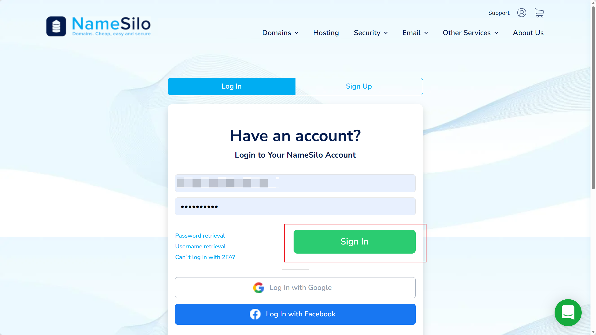

### 1.2 搜索域名

1. 登录后，在首页的域名搜索框中输入你想要的域名（例如：`example.com`）
2. 点击「Search」按钮
3. 查看域名是否可用以及价格
4. 或者直接访问：[Domain Name Search – Cheap .COMs + Free Privacy](https://www.namesilo.com/domain/search-domains)

### 1.3 添加到购物车

1. 如果域名可用，点击「Add」按钮将域名添加到购物车
2. 可以选择注册年限（通常 1 年最便宜，多年注册有优惠）
3. 如果需要，可以同时购买其他域名或服务
4. 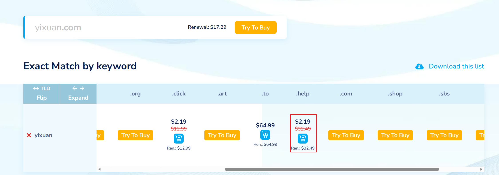


### 1.4 配置域名选项

在购物车中，可以配置以下选项：

- **Privacy**：隐私保护（默认免费开启，建议保持开启）
- **Auto-Renew**：自动续费（可选，建议开启）
- **Email Forwarding**：邮箱转发（可选，免费）

打开购物车：

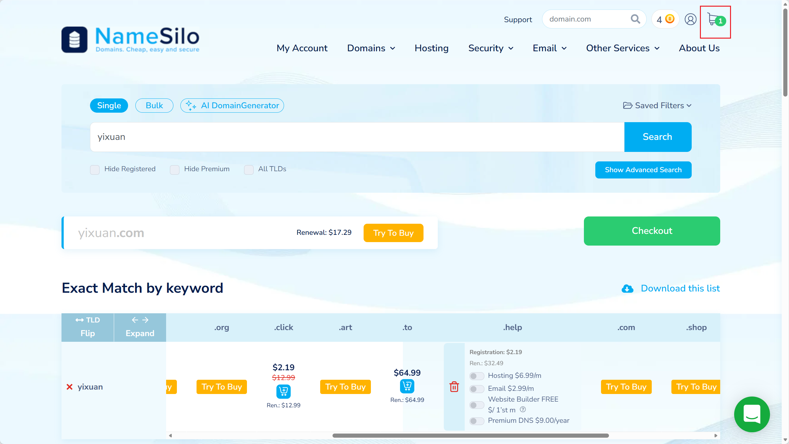

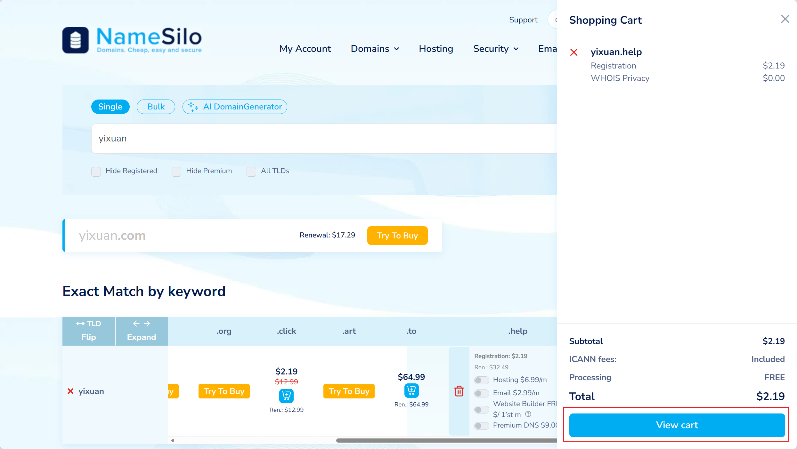

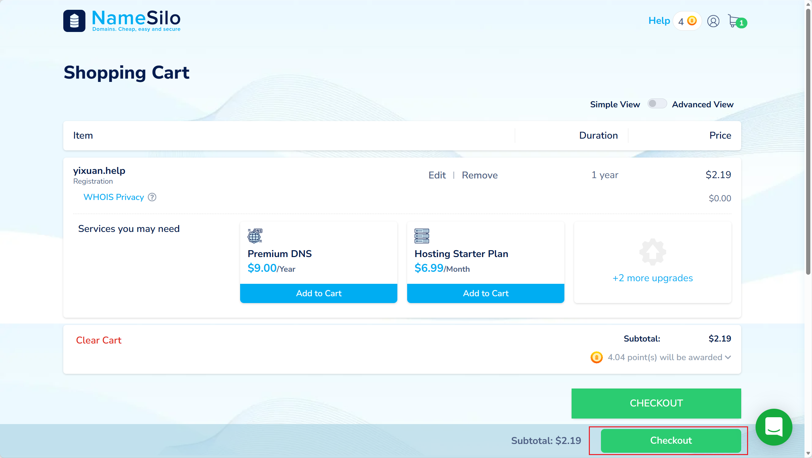

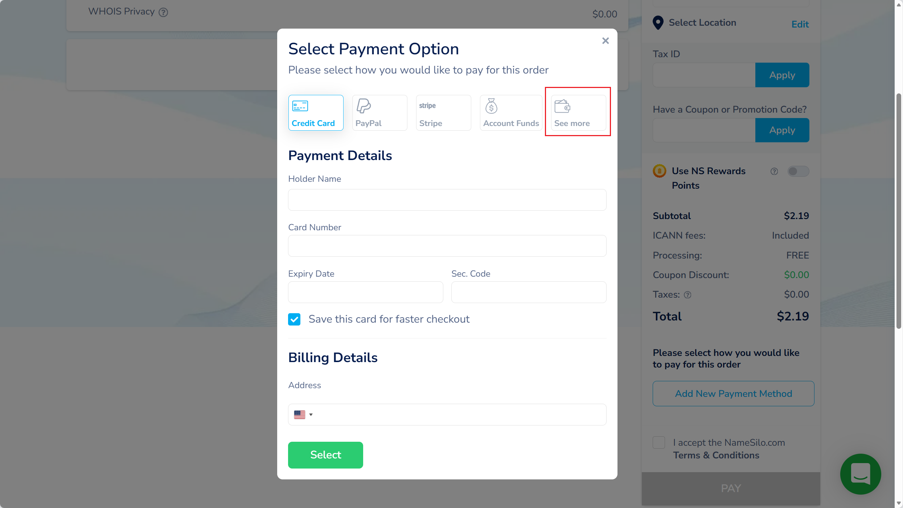

### 1.5 完成支付

1. 点击「Checkout」进入支付页面
2. 填写支付信息：
   - **支付方式**：支持信用卡、PayPal、支付宝等
   - **账单信息**：填写真实的账单地址
3. 选择支付宝支付

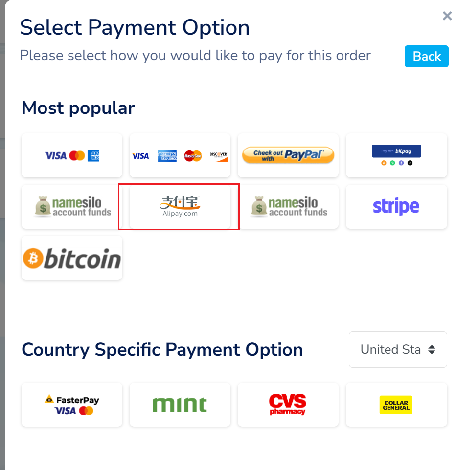

4. 确认订单信息
5. 点击「Complete Order」完成支付

### 1.6 验证域名购买

1. 支付成功后，会收到确认邮件
2. 在 Namesilo 控制面板的 [NameSilo - Dashboard](https://www.namesilo.com/account/)
3. 「My Domains」中可以看到购买的域名
4. 域名状态显示为「Active」表示购买成功


> 💡 **提示**：域名注册后，通常需要几分钟到几小时才能完全激活。

---

## 第二步：注册 Cloudflare 账号

### 2.1 访问 Cloudflare 官网

1. 访问 Cloudflare 官网：https://www.cloudflare.com/
2. 点击右上角的「Sign Up」按钮

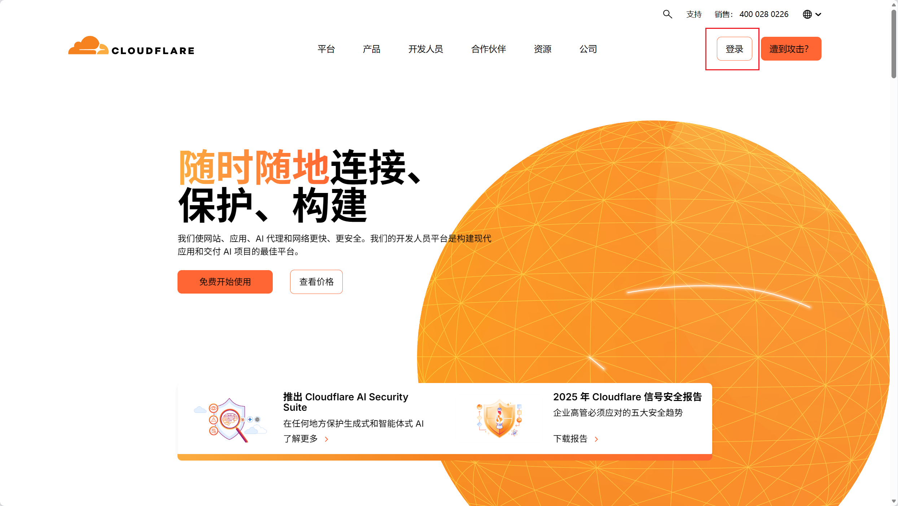

### 2.2 注册账号

1. 填写注册信息：
   - **邮箱**：用于登录和接收通知
   - **密码**：建议使用强密码（至少 8 位）
2. 点击「Sign up」按钮
3. 验证邮箱（如果需要）

### 2.3 登录控制台

1. 使用注册的邮箱和密码登录
2. 登录后会进入 Cloudflare Dashboard

> 💡 **提示**：Cloudflare 提供免费计划，完全足够个人博客使用。

---

## 第三步：在 Cloudflare 添加域名

### 3.1 添加站点

1. 登录 Cloudflare Dashboard
2. 点击「OnBoard a domain」或「添加站点」按钮
3. 输入你的域名（例如：`example.com`）注意：这里为你刚才买的**Namesilo域名，不用输入https://www**
4. 点击「Add site」按钮

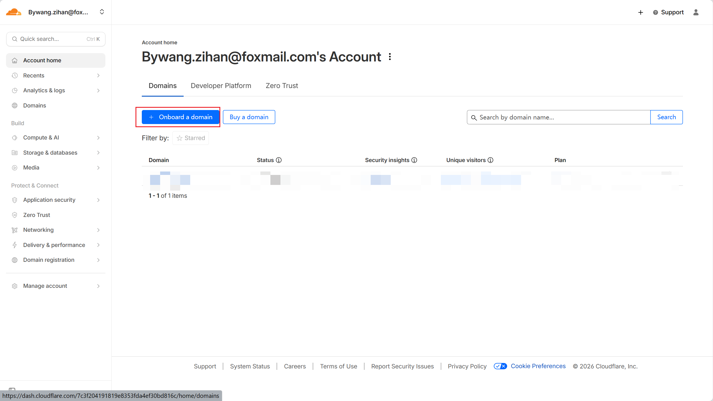

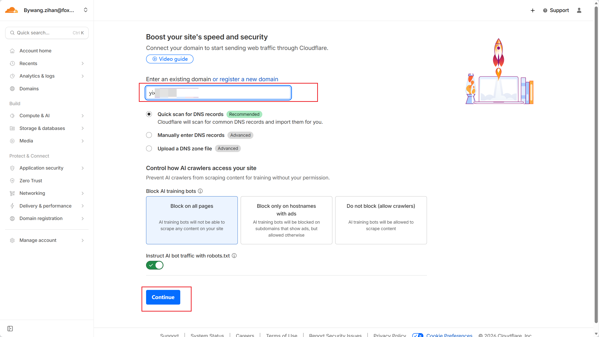

### 3.2 选择计划

Cloudflare 会提示你选择计划：

- **Free**：免费计划（推荐个人用户使用）
  - ✅ 免费 CDN
  - ✅ 免费 SSL 证书
  - ✅ 基础安全功能
  - ✅ 无限带宽（合理使用）

选择「Free」计划，然后点击「Continue」继续。

### 3.3 扫描 DNS 记录

Cloudflare 会自动扫描你域名的现有 DNS 记录：

1. 等待扫描完成（通常需要 1-2 分钟）
2. 查看扫描到的 DNS 记录
3. 确认记录是否正确（通常会扫描到 A 记录、CNAME 记录、MX 记录等）

### 3.4 查看 DNS 服务器地址

扫描完成后，Cloudflare 会显示两个 DNS 服务器地址，格式如下：

```
dana.ns.cloudflare.com
josh.ns.cloudflare.com
```

或者：

```
xxx.ns.cloudflare.com
yyy.ns.cloudflare.com
```

> ⚠️ **重要**：请记录这两个 DNS 服务器地址，下一步需要在 Namesilo 中修改。

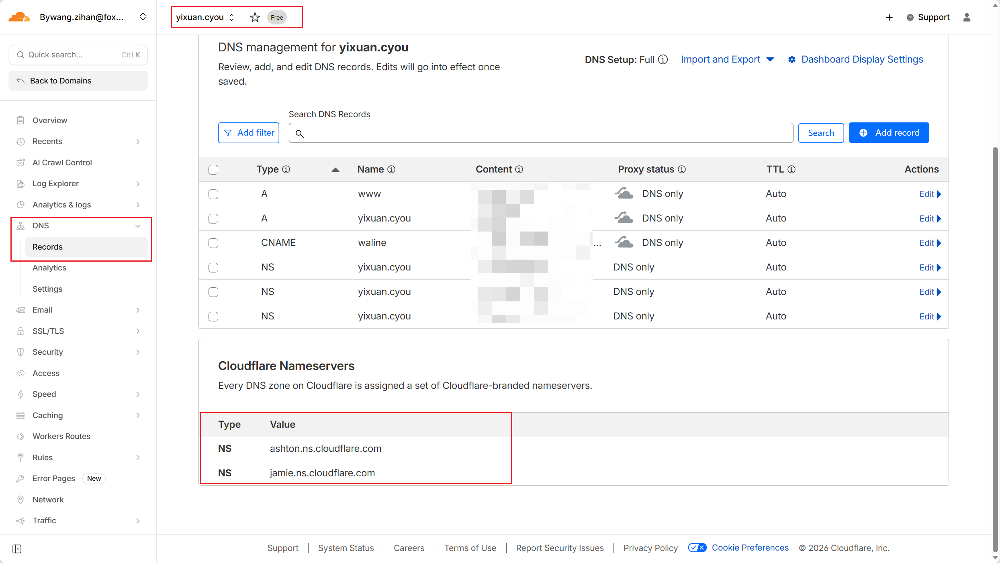

### 3.5 确认并继续

1. 检查 DNS 记录是否正确
2. 如果需要，可以手动添加或修改 DNS 记录
3. 点击「Continue」继续

---

## 第四步：修改 Namesilo DNS 服务器

### 4.1 登录 Namesilo 控制面板

1. 访问 Namesilo 官网并登录
2. 点击「My Account」→「My Domains」
3. https://www.namesilo.com/account
4. 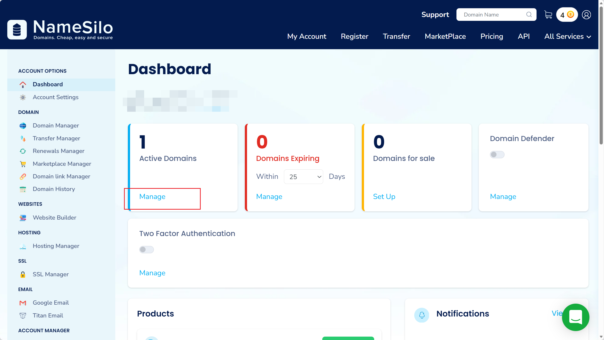
5. 找到你的域名，点击域名名称进入域名管理页面
6. 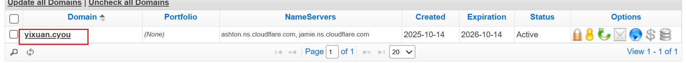

### 4.2 进入 DNS 服务器设置

1. 在域名管理页面，找到「Nameservers」部分
2. 点击「Change」按钮

### 4.3 修改 DNS 服务器

1. 选择「Custom」选项（自定义 DNS 服务器）
2. 删除默认的 Namesilo DNS 服务器地址
3. 输入 Cloudflare 提供的两个 DNS 服务器地址：
   - **Nameserver 1**：输入第一个 Cloudflare DNS 服务器（例如：`dana.ns.cloudflare.com`）
   - **Nameserver 2**：输入第二个 Cloudflare DNS 服务器（例如：`josh.ns.cloudflare.com`）
4. 点击「Submit」提交

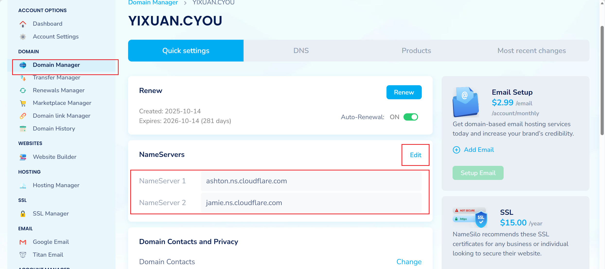

### 4.4 确认修改

1. 确认 DNS 服务器地址正确
2. 修改成功后，域名状态可能会显示「Pending」或「Updating」
3. DNS 服务器更改通常需要几分钟到几小时生效

> ⚠️ **重要**：DNS 服务器更改生效可能需要 24-48 小时，但通常 1-2 小时内就会生效。

### 4.5 返回 Cloudflare 完成设置

1. 修改 DNS 服务器后，返回 Cloudflare Dashboard
2. 在添加域名的流程中，点击「Continue」或「Done」
3. 等待 Cloudflare 检测 DNS 服务器更改（可能需要几分钟）

---

## 第五步：配置 DNS 记录

DNS 记录生效后，需要在 Cloudflare 中配置 DNS 记录，将域名指向你的网站服务器。

### 5.1 进入 DNS 设置

1. 在 Cloudflare Dashboard 中，点击你的域名
2. 点击左侧菜单「DNS」→「Records」
3. 可以看到现有的 DNS 记录列表

### 5.2 了解常用 DNS 记录类型

- **A 记录**：将域名指向 IPv4 地址
- **AAAA 记录**：将域名指向 IPv6 地址
- **CNAME 记录**：将域名指向另一个域名（别名）
- **MX 记录**：邮箱服务器记录
- **TXT 记录**：文本记录（用于验证等）

### 5.3 配置主域名

### 在 Cloudflare 中修改 DNS 配置

#### 配置项目地址

在Vercel中打开你的项目域名设置如下：

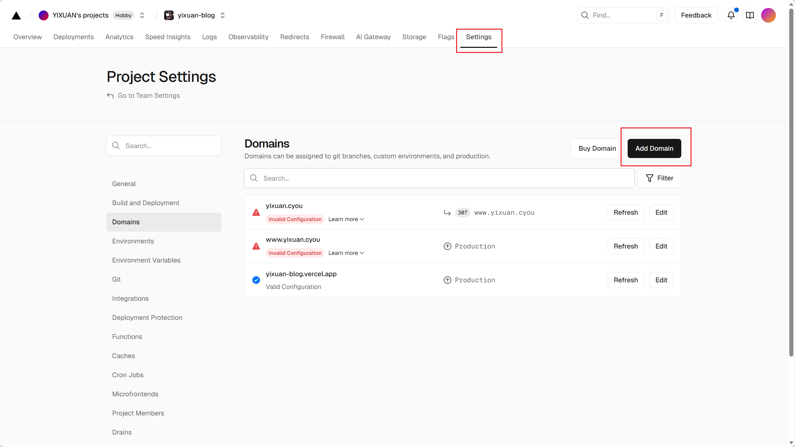

添加你购买的域名：

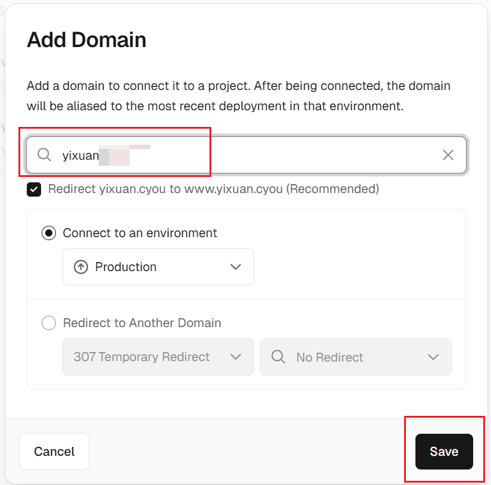

将下述配置添加在Cloudflare中：

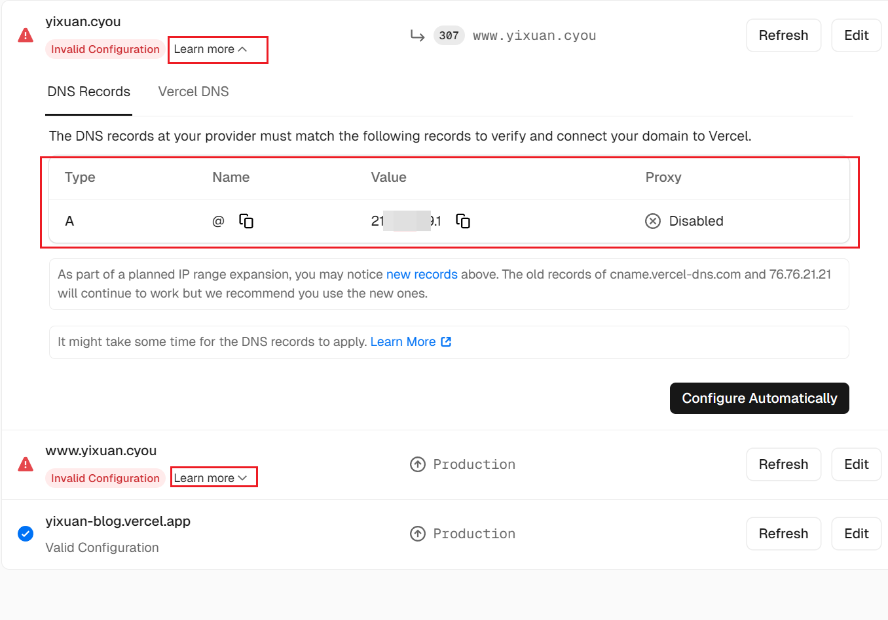

> 类型: A
>
> 名称: 你的域名
>
> 内容: cname.vercel-dns.com (Vercel 会提供具体值)
>
> 代理状态: DNS only (灰色云朵)

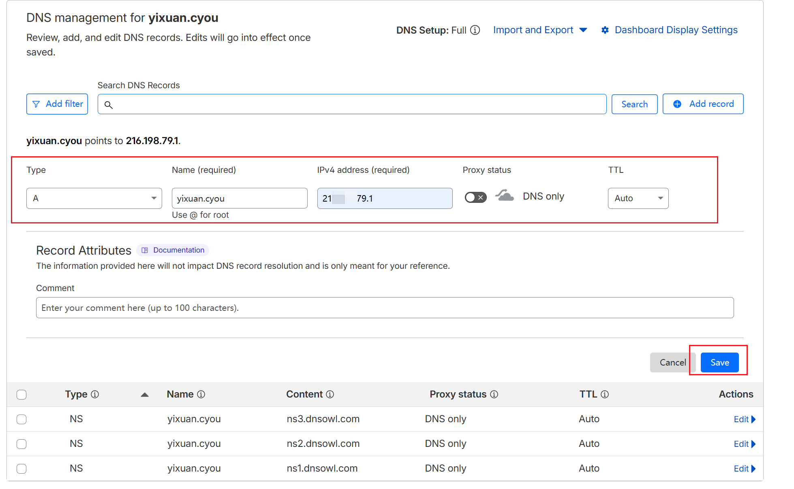

> 类型: A
>
> 名称: www
>
> 内容: cname.vercel-dns.com (Vercel 会提供具体值) 与上方的保持一致
>
> 代理状态: DNS only (灰色云朵)

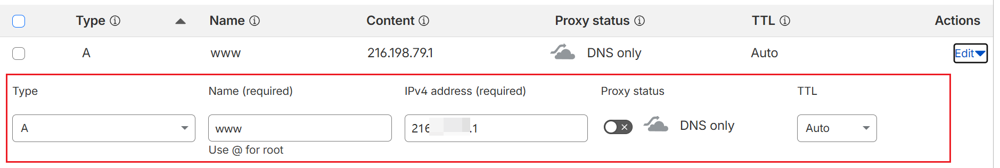

刷新之后显示下述就配置成功：

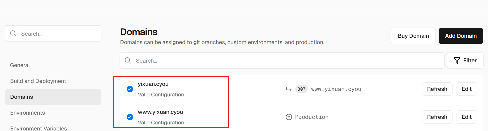

就可以通过该域名去访问你的网站了：

[懿轩的博客](https://www.yixuan.cyou/)

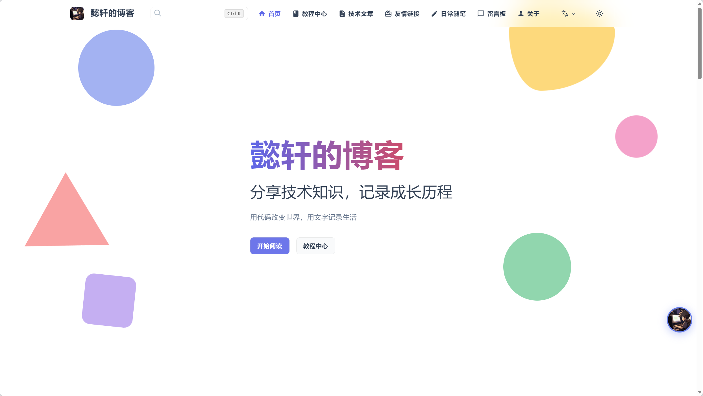

#### 配置Waline评论地址

同样在vercel打开你部署好的waline-server项目

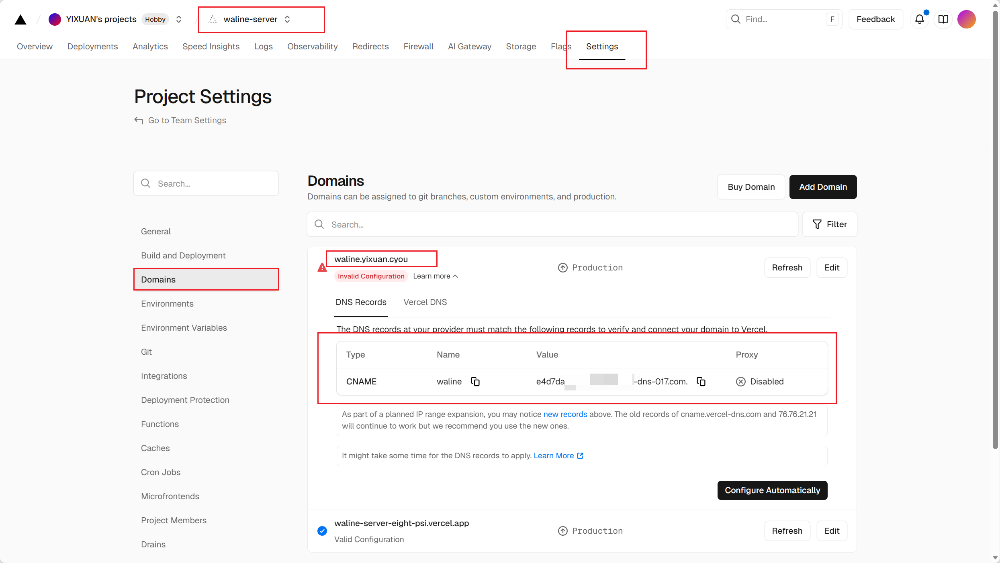

在cloudeflare中配置：

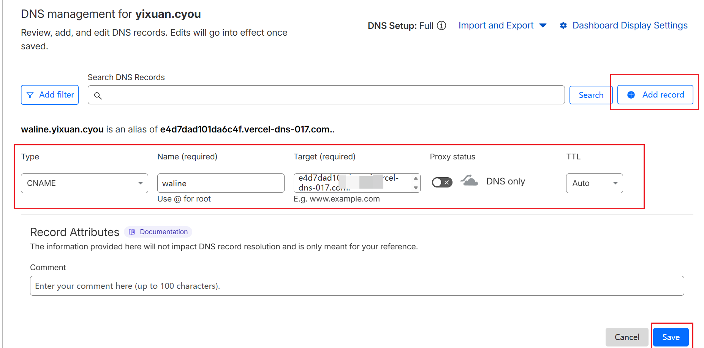

重新刷新Vercel页面就会发现配置成功：

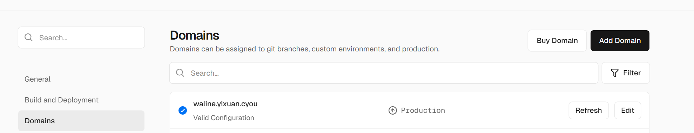

可以用该域名访问你的waline评论了

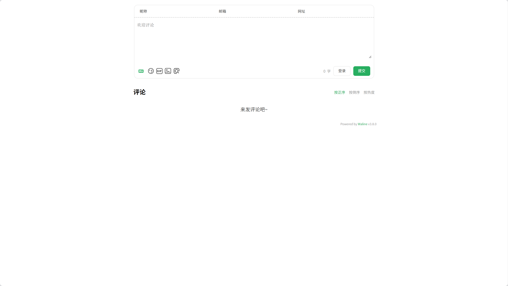

---

## 第六步：配置 SSL/TLS（可选）

Cloudflare 提供免费的 SSL 证书，配置 SSL/TLS 可以让你的网站支持 HTTPS 访问。

### 6.1 进入 SSL/TLS 设置

1. 在 Cloudflare Dashboard 中，点击你的域名
2. 点击左侧菜单「SSL/TLS」

### 6.2 选择 SSL/TLS 模式

Cloudflare 提供几种 SSL/TLS 模式：

- **Off**：关闭 SSL（不推荐）
- **Flexible**：灵活模式（Cloudflare ↔ 访客：HTTPS，Cloudflare ↔ 服务器：HTTP）
- **Full**：完全模式（Cloudflare ↔ 访客：HTTPS，Cloudflare ↔ 服务器：HTTPS，服务器不需要有效证书）
- **Full (strict)**：严格完全模式（Cloudflare ↔ 访客：HTTPS，Cloudflare ↔ 服务器：HTTPS，服务器需要有效证书）

**推荐设置：**

- **如果使用 Vercel**：选择「Full」或「Full (strict)」（Vercel 提供 SSL 证书）
- **如果使用自有服务器（无 SSL 证书）**：选择「Full」
- **如果使用自有服务器（有 SSL 证书）**：选择「Full (strict)」

### 6.3 设置 SSL/TLS 模式

1. 在「Overview」标签页中，找到「SSL/TLS encryption mode」
2. 选择「Full」模式（推荐）
3. 设置会自动保存

### 6.4 启用自动 HTTPS 重定向（可选）

1. 点击「SSL/TLS」→「Edge Certificates」标签页
2. 找到「Always Use HTTPS」选项
3. 点击「On」开关，启用自动 HTTPS 重定向
4. 启用后，所有 HTTP 请求会自动重定向到 HTTPS

### 6.5 验证 SSL 证书

1. 等待几分钟让 SSL 证书生效
2. 在浏览器中访问 `https://example.com`
3. 确认浏览器地址栏显示锁图标（🔒）
4. 点击锁图标可以查看证书详情

> 💡 **提示**：Cloudflare 的 SSL 证书通常会在几分钟内自动生成并生效。

---

## 常见问题

### Q1: DNS 服务器更改后多久生效？

**答案：**
- DNS 服务器更改通常需要 **1-2 小时**生效
- 最长可能需要 **24-48 小时**完全生效
- 可以使用 DNS 查询工具检查是否生效

### Q2: 为什么域名无法访问？

**可能原因：**
1. DNS 服务器更改未生效
2. DNS 记录配置错误
3. 服务器地址不正确
4. Cloudflare 代理模式配置错误

**解决方案：**
1. 检查 DNS 记录是否正确
2. 使用 DNS 查询工具检查 DNS 解析
3. 检查 Cloudflare 的 SSL/TLS 模式设置
4. 确认服务器运行正常

### Q3: SSL 证书未生效怎么办？

**可能原因：**
1. SSL/TLS 模式设置不正确
2. DNS 记录配置错误
3. 证书生成需要时间

**解决方案：**
1. 检查 Cloudflare 的 SSL/TLS 模式（建议使用「Full」）
2. 等待几分钟让证书生成
3. 清除浏览器缓存并刷新页面
4. 如果使用 Vercel，检查 Vercel 的域名配置

### Q4: 如何配置邮箱（MX 记录）？

如果需要使用域名邮箱（如 `mail@example.com`）：

1. 在 Cloudflare DNS 设置中添加 MX 记录
2. 填写邮箱服务商提供的 MX 记录信息
3. 通常需要添加多条 MX 记录（优先级不同）
4. 可以参考邮箱服务商（如 Google Workspace、腾讯企业邮箱）的配置文档

### Q5: Cloudflare 代理模式（Proxied）和仅 DNS（DNS only）的区别？

**Proxied（橙色云朵）**：
- ✅ 启用 CDN 加速
- ✅ 免费 SSL 证书
- ✅ DDoS 防护
- ✅ 隐藏服务器真实 IP

**DNS only（灰色云朵）**：
- ❌ 无 CDN 加速
- ❌ 无免费 SSL（需要服务器配置 SSL）
- ❌ 无 DDoS 防护
- ⚠️ 暴露服务器真实 IP

**推荐**：大多数情况下建议使用「Proxied」模式。

### Q6: 如何修改 DNS 记录？

1. 在 Cloudflare Dashboard 中，进入域名的 DNS 设置
2. 找到要修改的 DNS 记录
3. 点击记录右侧的「Edit」按钮
4. 修改记录内容
5. 点击「Save」保存

### Q7: 如何删除 DNS 记录？

1. 在 Cloudflare Dashboard 中，进入域名的 DNS 设置
2. 找到要删除的 DNS 记录
3. 点击记录右侧的「Delete」按钮
4. 确认删除操作

> ⚠️ **注意**：删除 DNS 记录可能导致相关服务无法访问，请谨慎操作。

### Q8: 如何从 Cloudflare 移除域名？

1. 在 Cloudflare Dashboard 中，点击你的域名
2. 进入「Overview」页面
3. 滚动到底部，找到「Advanced Actions」
4. 点击「Remove Site from Cloudflare」
5. 输入域名确认删除
6. 确认操作

> ⚠️ **注意**：移除域名后，需要将 DNS 服务器改回 Namesilo 的默认服务器，否则域名将无法解析。

### Q9: 如何配置子域名到不同的服务器？

如果需要将不同的子域名指向不同的服务器：

1. 在 Cloudflare DNS 设置中，为每个子域名添加独立的 DNS 记录
2. 例如：
   - `api.example.com` → 指向 API 服务器
   - `blog.example.com` → 指向博客服务器
   - `www.example.com` → 指向主网站服务器

### Q10: Cloudflare 免费版有什么限制？

Cloudflare 免费版的限制：

- ✅ **CDN 加速**：无限带宽（合理使用）
- ✅ **SSL 证书**：免费 SSL 证书
- ✅ **DNS 查询**：无限制
- ✅ **DDoS 防护**：基础防护
- ❌ **WAF 规则**：有限（付费版更强大）
- ❌ **图片优化**：无（付费版提供）
- ❌ **高级分析**：无（付费版提供）

对于个人博客，免费版完全足够使用。

### Q11: 域名转移到 Cloudflare 需要多久？

**答案：**
- DNS 服务器更改：1-2 小时
- DNS 记录生效：几分钟到几小时
- SSL 证书生成：几分钟

**总计时间：通常 1-2 小时内可以完成配置并生效。**

### Q12: 如何检查 DNS 是否生效？

可以使用以下工具检查 DNS 是否生效：

1. **在线 DNS 查询工具**：
   - https://dnschecker.org/
   - https://mxtoolbox.com/
   - https://www.whatsmydns.net/

2. **命令行工具**：
   ```bash
   # Windows
   nslookup example.com
   
   # macOS/Linux
   dig example.com
   ```

### Q13: Cloudflare 和 Vercel 的 SSL 证书冲突吗？

**答案：不会冲突。**

- Cloudflare 提供「边缘 SSL 证书」（访客 ↔ Cloudflare）
- Vercel 提供「源服务器 SSL 证书」（Cloudflare ↔ Vercel）
- 两者可以同时使用，互不冲突

**推荐配置：**
- Cloudflare SSL/TLS 模式：**Full** 或 **Full (strict)**
- Vercel 自动配置 SSL 证书

### Q14: 如何配置域名重定向？

如果需要将 `www.example.com` 重定向到 `example.com`：

1. 在 Cloudflare Dashboard 中，进入域名的「Rules」→「Page Rules」
2. 创建新的页面规则：
   - **URL**：`www.example.com/*`
   - **Setting**：选择「Forwarding URL」→「301 Permanent Redirect」
   - **Destination URL**：`https://example.com/$1`
3. 保存规则

> 💡 **提示**：免费版 Cloudflare 可以创建 3 条页面规则。

### Q15: 如何优化 Cloudflare 性能？

**建议配置：**

1. **启用自动 HTTPS 重定向**：SSL/TLS → Edge Certificates → Always Use HTTPS
2. **启用 Brotli 压缩**：Speed → Optimization → Brotli（自动启用）
3. **启用 HTTP/2 和 HTTP/3**：Network → HTTP/2 和 HTTP/3（自动启用）
4. **配置缓存规则**：Caching → Configuration（根据需要配置）

---

## 注意事项

### ⚠️ 安全建议

1. **保护 Cloudflare 账号**：使用强密码，启用双因素认证（2FA）
2. **保护 Namesilo 账号**：使用强密码，启用账户安全功能
3. **定期检查 DNS 记录**：定期检查 DNS 记录是否有异常修改
4. **启用 Cloudflare 安全功能**：在「Security」设置中启用相关安全功能

### 💡 最佳实践

1. **使用「Proxied」模式**：启用 CDN 和 SSL，提升性能和安全性
2. **启用自动 HTTPS 重定向**：确保所有流量使用 HTTPS
3. **定期备份 DNS 记录**：记录所有 DNS 记录配置，方便恢复
4. **监控域名状态**：定期检查域名和 DNS 配置状态
5. **使用强密码**：为 Namesilo 和 Cloudflare 账号使用强密码

### 📚 相关资源

- [Namesilo 官方网站](https://www.namesilo.com/)
- [Namesilo 帮助文档](https://www.namesilo.com/support/)
- [Cloudflare 官方网站](https://www.cloudflare.com/)
- [Cloudflare 学习中心](https://www.cloudflare.com/learning/)
- [Cloudflare DNS 文档](https://developers.cloudflare.com/dns/)
- [Vercel 自定义域名文档](https://vercel.com/docs/concepts/projects/domains)

---

## 总结

配置 Namesilo + Cloudflare 域名的完整流程：

### 快速检查清单

- [ ] 在 Namesilo 注册账号并购买域名
- [ ] 注册 Cloudflare 账号
- [ ] 在 Cloudflare 添加域名并选择免费计划
- [ ] 记录 Cloudflare 的 DNS 服务器地址
- [ ] 在 Namesilo 修改域名的 DNS 服务器为 Cloudflare 的地址
- [ ] 等待 DNS 服务器更改生效
- [ ] 在 Cloudflare 配置 DNS 记录（A 记录或 CNAME 记录）
- [ ] 配置 SSL/TLS 模式（推荐「Full」）
- [ ] 启用自动 HTTPS 重定向
- [ ] 如果使用 Vercel，在 Vercel 中添加自定义域名
- [ ] 验证域名和 SSL 证书是否生效
- [ ] 测试网站访问和性能

### 配置步骤总结

1. ✅ **购买域名**：在 Namesilo 购买域名
2. ✅ **注册 Cloudflare**：注册 Cloudflare 账号
3. ✅ **添加域名**：在 Cloudflare 添加域名并获取 DNS 服务器地址
4. ✅ **修改 DNS 服务器**：在 Namesilo 修改 DNS 服务器为 Cloudflare 的地址
5. ✅ **配置 DNS 记录**：在 Cloudflare 配置 DNS 记录指向服务器
6. ✅ **配置 SSL/TLS**：启用 SSL/TLS 和自动 HTTPS 重定向
7. ✅ **配置 Vercel**：如果使用 Vercel，添加自定义域名
8. ✅ **验证配置**：检查域名、SSL 证书和网站访问

### 重要提示

- ⚠️ **DNS 生效时间**：DNS 服务器更改可能需要 1-2 小时生效
- ⚠️ **DNS 记录生效**：DNS 记录更改通常几分钟内生效，最长 48 小时
- 💡 **推荐配置**：使用「Proxied」模式启用 CDN 和 SSL
- 💡 **SSL 证书**：Cloudflare 和 Vercel 的 SSL 证书不会冲突
- 💡 **免费使用**：Cloudflare 免费版完全足够个人博客使用

如果遇到问题，请参考「常见问题」部分或查看相关文档。

---

<div align="center">

## 🎉 配置完成！

**配置完成后，你的域名就可以正常访问，并且享受 Cloudflare 的 CDN 加速和免费 SSL 证书了！**

### 📚 相关资源

- [Namesilo 官方网站](https://www.namesilo.com/)
- [Cloudflare 官方网站](https://www.cloudflare.com/)
- [Cloudflare 学习中心](https://www.cloudflare.com/learning/)
- [Vercel 自定义域名文档](https://vercel.com/docs/concepts/projects/domains)

### 💬 获取帮助

如有问题，欢迎通过以下方式获取帮助：

- 📧 提交 [Issue](https://github.com/YIXUAN-oss/Blog-Template/issues)
- 📖 查看相关文档
- 🔍 搜索相关问题
- 📚 查看 Cloudflare 和 Namesilo 官方文档

---

**祝你使用愉快！** ✨

</div>

