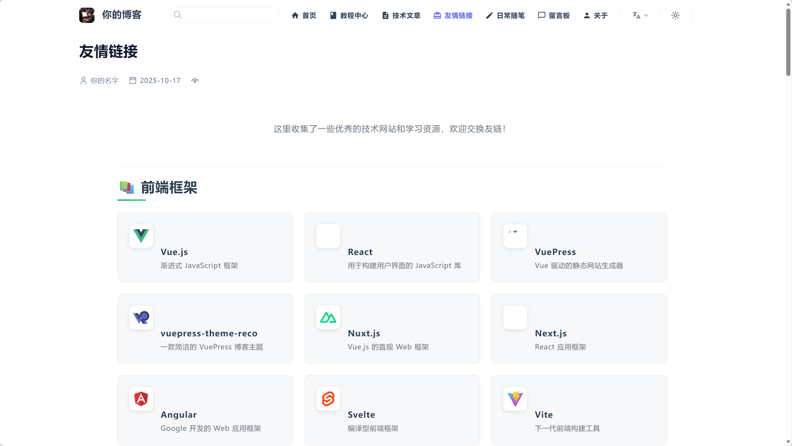
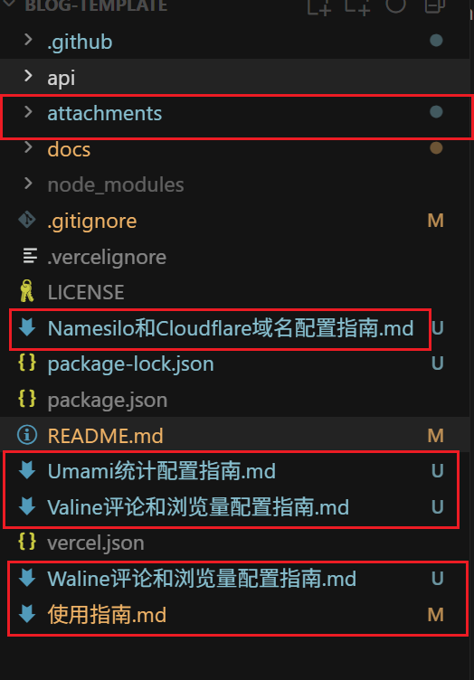

# [你的博客名称] | [Your Blog Name]


---

## ✨ 特性

在线展示地址：[你的博客](https://your-domain.com/)

- 🎨 **美观主题** - 支持卡片式布局、动画过渡、响应式设计
- 🌐 **多语言支持** - 中文 / 英文 自动切换（可扩展更多语言）
- 🔍 **全局搜索** - 内置搜索，支持关键词高亮
- 🌙 **暗黑模式** - 自动跟随系统，支持手动切换
- 📱 **移动友好** - 完美适配手机、平板、桌面
- 📈 **SEO 优化** - 自动生成 sitemap、meta 标签、RSS 支持
- 🖼️ **图片懒加载** - 提升加载速度
- 📊 **统计分析** - 可选集成Umami（自托管）
- 🧩 **插件丰富** - 代码复制、阅读进度、页面滚动效果等





## 🚀 快速开始

### 安装依赖

```bash
npm install
```

### 本地开发

```bash
npm run dev
```

访问 `http://localhost:8080` 查看效果

### 构建部署

```bash
npm run build
```

生成的静态文件在 `docs/.vuepress/dist` 目录

## 📂 项目结构

```text
Blog-Template/
├── docs/                      # 文档 & 内容根目录
│   ├── .vuepress/             # VuePress 配置 & 样式
│   │   ├── config.ts          # 主配置文件
│   │   ├── client.ts          # 客户端增强
│   │   ├── public/            # 静态资源（logo、头像等）
│   │   └── styles/            # 自定义样式
│   ├── blogs/                 # 博客文章
│   ├── tutorials/             # 教程中心
│   ├── diary/                 # 日常随笔
│   ├── friendship/            # 友情链接
│   ├── guestbook/             # 留言板
│   ├── en/                    # 英文首页等
│   └── README.md              # 中文首页
├── package.json               # 项目配置
├── vercel.json                # Vercel 部署配置
└── README.md                  # 仓库说明
```

## 📝 内容管理

### 添加文章

在对应目录下创建 Markdown 文件，例如：

```markdown
---
title: 文章标题
date: 2025-01-01
categories:
  - 分类
tags:
  - 标签1
  - 标签2
---

文章内容...
```

### 添加教程

在 `docs/tutorials/` 目录下创建对应的教程分类文件夹。

------

## 📖 使用指南

> 💡 **完整的使用指南请查看：[使用指南.md](./使用指南.md)**

使用指南包含以下内容：

- 🚀 **快速开始** - 克隆项目、安装依赖、本地开发、构建部署
- ⚙️ **首次配置** - 修改个人信息、项目信息、配置部署路径
- ✍️ **添加内容** - 添加博客文章、日常随笔、教程分类
- 🎨 **自定义配置** - 修改主题色、导航栏、侧边栏、自定义样式
- 🌐 **多语言配置** - 添加英文内容、配置语言切换
- 🔌 **添加插件** - 评论系统（Giscus/Waline/Valine）、统计分析（Umami/Google Analytics）
- 🚀 **部署指南** - GitHub Pages、Vercel（推荐）、自定义域名配置

**相关配置指南：**

- 📝 [Waline 评论和浏览量配置指南](./Waline评论和浏览量配置指南.md)
- 📝 [Valine 评论和浏览量配置指南](./Valine评论和浏览量配置指南.md)
- 📊 [Umami 统计配置指南](./Umami统计配置指南.md)
- 🌍 [Namesilo + Cloudflare 域名配置指南](./Namesilo和Cloudflare域名配置指南.md)

---

## 💡归档操作

当按照上述配置成功后，可以删除下述文件或文件夹：



## 👤 作者

**[你的名字] ([Your Name])**

- 📧 Email: your.email@example.com
- 🐙 GitHub: [@your-username](https://github.com/your-username)

## 📄 许可证

[MIT](LICENSE) © [你的名字]

