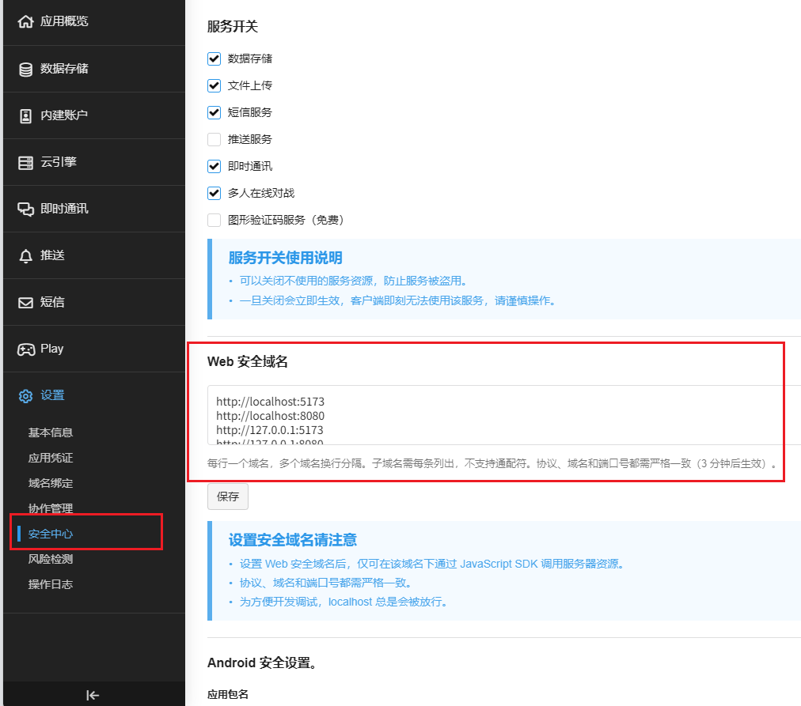
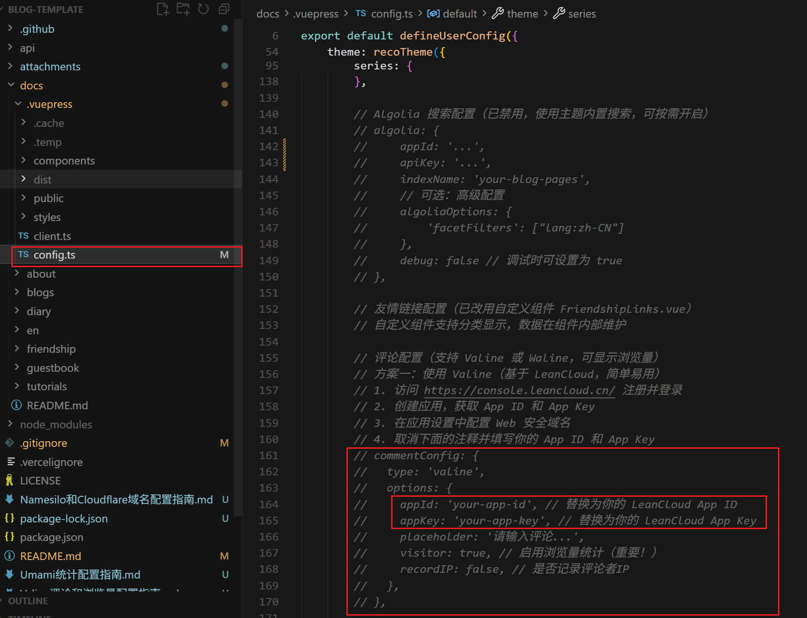

# Valine 评论和浏览量配置完整指南

> 本指南将帮助你从零开始配置 Valine 评论系统，包括获取 LeanCloud 应用凭证、配置评论功能和浏览量统计。

## 📋 目录

- [什么是 Valine](#什么是-valine)
- [快速开始](#快速开始)
- [第一步：注册 LeanCloud 账号](#第一步注册-leancloud-账号)
- [第二步：创建应用并获取凭证](#第二步创建应用并获取凭证)
- [第三步：配置 Web 安全域名](#第三步配置-web-安全域名)
- [第四步：在博客中配置 Valine](#第四步在博客中配置-valine)
- [第五步：配置浏览量统计](#第五步配置浏览量统计)
- [第六步：验证配置](#第六步验证配置)
- [高级配置选项](#高级配置选项)
- [数据管理](#数据管理)
- [常见问题](#常见问题)
- [注意事项](#注意事项)
- [总结](#总结)

---

## 什么是 Valine

Valine 是一款基于 **LeanCloud** 的快速、简洁且高效的无后端评论系统。它的特点包括：

- ✅ **无需后端**：基于 LeanCloud 云服务，无需自己搭建服务器
- ✅ **轻量快速**：体积小，加载速度快
- ✅ **支持浏览量统计**：可以统计文章浏览量（需要配置 `visitor: true`）
- ✅ **匿名评论**：支持匿名评论，降低使用门槛
- ✅ **Markdown 支持**：评论支持 Markdown 语法
- ✅ **邮件通知**：可配置邮件通知（需要 LeanCloud 付费版）
- ✅ **多语言支持**：支持中文、英文、日文等多种语言
- ✅ **自定义头像**：支持多种头像风格

---

## 快速开始

如果你已经熟悉 LeanCloud，可以按照以下步骤快速配置：

1. **注册 LeanCloud 账号**（约 2 分钟）
   - 访问 https://console.leancloud.app/register
   - 注册并验证邮箱

2. **创建应用并获取凭证**（约 1 分钟）
   - 创建新应用
   - 获取 App ID 和 App Key

3. **配置安全域名**（约 1 分钟）
   - 添加 `localhost` 和你的生产域名

4. **配置博客**（约 2 分钟）
   - 在 `docs/.vuepress/config.ts` 中填写配置
   - 启用 `visitor: true` 启用浏览量统计

5. **测试验证**（约 1 分钟）
   - 启动本地服务器测试
   - 验证评论和浏览量功能

**总计时间：约 7 分钟** ⏱️

> 💡 **提示**：如果你是第一次配置，建议按照下面的详细步骤操作。

---

## 第一步：注册 LeanCloud 账号

### 1.1 选择 LeanCloud 版本

根据你的需求选择合适的版本：

- **国际版（推荐）**：https://console.leancloud.app/
  - ✅ 无需备案
  - ✅ 访问速度快（海外用户）
  - ✅ 配置简单
  - ⚠️ 国内访问可能较慢

- **国内版**：https://console.leancloud.cn/
  - ✅ 国内访问速度快
  - ⚠️ 需要备案域名
  - ⚠️ 需要购买独立 IP（￥50/月）

> 💡 **推荐**：对于大多数用户，建议使用**国际版**，配置更简单，无需备案。

### 1.2 注册账号

1. 访问注册页面：[注册 · LeanCloud 国际版](https://console.leancloud.app/register)
2. 填写注册信息：
   - **邮箱**：用于接收验证邮件和登录
   - **密码**：建议使用强密码
   - **用户名**：可选，用于显示
3. 点击「注册」按钮

### 1.3 验证邮箱

注册成功后，LeanCloud 会发送验证邮件到你的邮箱：


1. 打开邮箱，找到 LeanCloud 发送的验证邮件
2. 点击邮件中的验证链接
3. 验证成功后，即可登录控制台

### 1.4 登录控制台

验证邮箱后，使用注册的邮箱和密码登录 LeanCloud 控制台。

### 1.5 关于国内版（可选）

如果你需要使用国内版 LeanCloud，需要注意以下事项：

> ⚠️ **国内版需要完成备案接入**
>
> 如果你正在使用 Leancloud 国内版 ([leancloud.cn](https://leancloud.cn/))，我们推荐你切换到国际版 ([leancloud.app](https://leancloud.app/))。否则，你需要为应用额外绑定**已备案**的域名，同时购买独立 IP 并完成备案接入:
>
> - 登录国内版并进入需要使用的应用
> - 选择 `设置` > `域名绑定` > `API 访问域名` > `绑定新域名` > 输入域名 > `确定`。
> - 按照页面上的提示按要求在 DNS 上完成 CNAME 解析。
> - 购买独立 IP 并提交工单完成备案接入。(独立 IP 目前价格为 ￥ 50/个/月)


> 💡 **建议**：除非有特殊需求，否则使用国际版即可，配置更简单。

> 国内版需要完成备案接入
>
> 如果你正在使用 Leancloud 国内版 ([leancloud.cn](https://leancloud.cn/))，我们推荐你切换到国际版 ([leancloud.app](https://leancloud.app/))。否则，你需要为应用额外绑定**已备案**的域名，同时购买独立 IP 并完成备案接入:
>
> - 登录国内版并进入需要使用的应用
> - 选择 `设置` > `域名绑定` > `API 访问域名` > `绑定新域名` > 输入域名 > `确定`。
> - 按照页面上的提示按要求在 DNS 上完成 CNAME 解析。
> - 购买独立 IP 并提交工单完成备案接入。(独立 IP 目前价格为 ￥ 50/个/月)


---

## 第二步：创建应用并获取凭证

### 2.1 创建新应用

1. 登录后，点击控制台首页的「创建应用」按钮
2. 填写应用信息：
   - **应用名称**：例如 `my-blog-comments`（建议使用有意义的名称）
   - **开发环境**：选择「开发版」（免费版）
   - **应用类型**：选择「Web 应用」
3. 点击「创建」完成应用创建


### 2.2 获取 App ID 和 App Key


1. 在应用列表中，点击你刚创建的应用
2. 进入应用后，点击左侧菜单「设置」→「应用 Keys」
3. 在页面中可以看到：
   - **App ID**：例如 `xxxxxxxxxxxxxxxxxxxxxx`
   - **App Key**：例如 `xxxxxxxxxxxxxxxxxxxxxx`
   - **Master Key**：**请勿泄露**，仅在服务端使用

> ⚠️ **重要**：请妥善保管你的 App ID 和 App Key，不要泄露给他人。

### 2.3 记录凭证信息

将以下信息记录下来，后续配置会用到：

```
App ID: xxxxxxxxxxxxxxxxxxxxxx
App Key: xxxxxxxxxxxxxxxxxxxxxx
```

---

## 第三步：配置 Web 安全域名

### 3.1 进入安全设置

1. 在应用控制台中，点击左侧菜单「设置」→「安全中心」
2. 找到「Web 安全域名」设置项

### 3.2 添加域名

根据你的博客部署情况，添加以下域名：

#### 情况一：本地开发环境

添加以下域名（必须添加，否则本地无法测试）：

```
http://localhost:5173
http://localhost:8080
http://127.0.0.1:5173
http://127.0.0.1:8080
https://www.你的域名.后缀
https://你的域名.后缀
```



> 💡 **提示**：即使你只部署到生产环境，也建议添加本地域名以便本地测试。

#### 情况二：多环境部署

如果你同时使用多个部署平台，可以添加所有域名：

```
localhost
127.0.0.1
your-username.github.io
your-blog.vercel.app
blog.example.com
```

> 💡 **提示**：每行一个域名，可以添加多个域名。

> 💡 **提示**：
>
> - 可以添加多个域名，每行一个
> - 不需要添加 `http://` 或 `https://` 前缀
> - 不需要添加端口号（如 `:8080`）
> - 支持通配符域名（如 `*.example.com`）

### 3.3 保存设置

点击「保存」按钮保存域名配置。

> ⚠️ **注意**：如果不配置 Web 安全域名，Valine 将无法正常工作，会提示「域名未在安全域名列表中」。

---

## 第四步：在博客中配置 Valine

### 4.1 打开配置文件

打开 `docs/.vuepress/config.ts` 文件，找到评论配置部分（大约在第 155 行）。

### 4.2 修改配置

找到被注释的 Valine 配置部分：

```typescript
// 方案一：使用 Valine（基于 LeanCloud，简单易用）
// commentConfig: {
//   type: 'valine',
//   options: {
//     appId: 'your-app-id', // 替换为你的 LeanCloud App ID
//     appKey: 'your-app-key', // 替换为你的 LeanCloud App Key
//     placeholder: '请输入评论...',
//     visitor: true, // 启用浏览量统计（重要！）
//     recordIP: false, // 是否记录评论者IP
//   },
// },
```



### 4.3 取消注释并填写配置

将上面的注释取消，并替换为你的实际配置：

```typescript
// 方案一：使用 Valine（基于 LeanCloud，简单易用）
commentConfig: {
  type: 'valine',
  options: {
    appId: 'xxxxxxxxxxxxxxxxxxxxxx', // 替换为你的 LeanCloud App ID
    appKey: 'xxxxxxxxxxxxxxxxxxxxxx', // 替换为你的 LeanCloud App Key
    placeholder: '请输入评论...', // 评论框占位提示文字
    visitor: true, // 启用浏览量统计（重要！）
    recordIP: false, // 是否记录评论者IP（建议设为 false 保护隐私）
  },
},
```

### 4.4 禁用其他评论系统（如果已配置）

如果之前配置了 Waline 或其他评论系统，需要将其注释掉：

```typescript
// 方案二：使用 Waline（推荐，功能更强大，支持浏览量统计）
// commentConfig: {
//   type: 'waline',
//   options: {
//     serverURL: 'https://your-waline-domain.com',
//     // ... 其他配置
//   },
// },
```

### 4.5 完整配置示例

以下是完整的 `commentConfig` 配置示例：

```typescript
theme: recoTheme({
  // ... 其他配置

  // 评论配置
  commentConfig: {
    type: 'valine',
    options: {
      // 必填：LeanCloud 应用凭证
      appId: 'your-app-id',        // 替换为你的 App ID
      appKey: 'your-app-key',       // 替换为你的 App Key
      
      // 可选：评论框配置
      placeholder: '请输入评论...',  // 评论框占位提示
      avatar: 'mp',                 // 头像风格：mp(神秘人)、identicon(几何图形)、monsterid(小怪物)、wavatar(生成头像)、retro(复古)、robohash(机器人)、blank(空白)
      pageSize: 10,                 // 每页显示评论数
      lang: 'zh-CN',                // 语言：zh-CN(中文)、en(英文)、ja(日文)等
      
      // 可选：功能配置
      visitor: true,                // 启用浏览量统计（重要！）
      recordIP: false,              // 是否记录评论者IP（建议 false 保护隐私）
      enableQQ: false,             // 是否启用QQ昵称和头像
      
      // 可选：国内版 LeanCloud 需要配置
      // serverURLs: 'https://your-domain.com', // 国内版需要填写，国际版不需要
    },
  },
})
```

### 4.6 实际配置示例

以下是一个实际可用的配置示例（请替换为你的实际 App ID 和 App Key）：

```typescript
// 在 docs/.vuepress/config.ts 中
theme: recoTheme({
  // ... 其他配置
  
  commentConfig: {
    type: 'valine',
    options: {
      appId: 'ABC123XYZ456',           // 你的 App ID
      appKey: 'DEF789GHI012',           // 你的 App Key
      placeholder: '说点什么吧~',         // 评论框提示文字
      avatar: 'identicon',              // 使用几何图形头像
      pageSize: 10,                     // 每页显示 10 条评论
      lang: 'zh-CN',                    // 中文界面
      visitor: true,                    // ✅ 启用浏览量统计
      recordIP: false,                  // 不记录 IP（保护隐私）
    },
  },
})
```

### 4.7 配置检查清单

配置完成后，请检查以下项目：

- [ ] App ID 已正确填写（不是 `your-app-id`）
- [ ] App Key 已正确填写（不是 `your-app-key`）
- [ ] `visitor: true` 已启用（如果需要浏览量统计）
- [ ] 其他评论系统已注释掉（如 Waline）
- [ ] 配置文件语法正确（没有缺少逗号或括号）

---

## 第五步：配置浏览量统计

Valine 支持浏览量统计功能，可以统计每篇文章的访问次数。配置浏览量统计需要以下步骤：

### 5.1 启用浏览量统计

在 `config.ts` 中，确保 `visitor: true` 已启用：

```typescript
commentConfig: {
  type: 'valine',
  options: {
    appId: 'your-app-id',
    appKey: 'your-app-key',
    visitor: true, // ✅ 启用浏览量统计（重要！）
    // ... 其他配置
  },
}
```

### 5.2 浏览量显示位置

启用 `visitor: true` 后，浏览量会在以下位置显示：

1. **文章详情页**：在文章标题下方或元信息中显示
2. **LeanCloud 数据表**：在 `Counter` 表中存储浏览量数据

### 5.3 浏览量工作原理

- 每次访问文章页面时，Valine 会自动调用 LeanCloud API 增加浏览量计数
- 浏览量数据存储在 LeanCloud 的 `Counter` 数据表中
- 每个页面路径对应一个独立的浏览量计数

### 5.4 查看浏览量数据

1. 登录 LeanCloud 控制台
2. 进入你的应用
3. 点击「数据存储」→「结构化数据」
4. 找到 `Counter` 表，可以看到：
   - `time`：浏览量数字
   - `url`：页面路径
   - `createdAt`：创建时间
   - `updatedAt`：更新时间

### 5.5 浏览量统计注意事项

- ⚠️ **刷新页面会增加浏览量**：每次刷新页面都会增加一次浏览量
- ⚠️ **免费版有限制**：LeanCloud 免费版每天有 30,000 次 API 调用限制
- 💡 **建议**：对于个人博客，免费版通常足够使用

### 5.6 自定义浏览量显示

如果需要自定义浏览量显示样式，可以在 `docs/.vuepress/styles/index.scss` 中添加：

```scss
// 自定义浏览量显示样式
.page-meta {
  .visitor-count {
    color: #3eaf7c;
    font-weight: bold;
  }
}
```

---

## 第六步：验证配置

### 6.1 启动本地开发服务器

```bash
npm run dev
```

### 6.2 访问博客页面

1. 打开浏览器访问 `http://localhost:8080`
2. 导航到任意文章页面或留言板页面（`/guestbook/`）
3. 滚动到页面底部

### 6.3 检查评论框

如果配置正确，你应该能看到：

- ✅ Valine 评论框正常显示
- ✅ 评论框中有「请输入评论...」占位文字
- ✅ 可以输入昵称、邮箱、网址等信息
- ✅ 可以提交评论

### 6.4 测试评论功能

1. 在评论框中填写：
   - **昵称**：测试用户
   - **邮箱**：test@example.com（可选）
   - **网址**：https://example.com（可选）
   - **评论内容**：这是一条测试评论
2. 点击「提交」按钮
3. 如果成功，评论会立即显示在评论列表中

### 6.5 验证 LeanCloud 数据

1. 回到 LeanCloud 控制台
2. 进入你的应用
3. 点击左侧菜单「数据存储」→「结构化数据」
4. 你应该能看到以下数据表：
   - `Comment`：存储评论数据
   - `Counter`：存储浏览量数据（如果启用了 `visitor: true`）

### 6.6 检查浏览量统计

如果启用了 `visitor: true`：

1. **刷新文章页面**：多次刷新同一篇文章页面
2. **查看浏览量显示**：在文章标题下方或元信息中应该能看到浏览量数字
3. **验证计数**：每次刷新页面，浏览量应该会增加
4. **检查数据表**：在 LeanCloud 控制台的 `Counter` 表中可以看到浏览量数据

> 💡 **提示**：如果浏览量不显示，请检查：
> - 配置中 `visitor: true` 是否已启用
> - LeanCloud 控制台的 `Counter` 表是否有数据
> - 浏览器控制台是否有错误信息

---

## 数据管理

### 查看评论数据

1. 登录 LeanCloud 控制台
2. 进入你的应用
3. 点击「数据存储」→「结构化数据」
4. 找到 `Comment` 表，可以看到所有评论数据

### 查看浏览量数据

1. 在「数据存储」→「结构化数据」中找到 `Counter` 表
2. 可以看到每个页面的浏览量数据
3. `time` 字段表示浏览量数字

### 导出数据

1. 在数据表页面，点击「导出」按钮
2. 选择导出格式（CSV 或 JSON）
3. 下载数据文件

### 删除数据

> ⚠️ **警告**：删除操作不可恢复，请谨慎操作。

1. 在数据表中选择要删除的记录
2. 点击「删除」按钮
3. 确认删除操作

### 备份数据

建议定期备份评论和浏览量数据：

1. 定期导出 `Comment` 和 `Counter` 表的数据
2. 将数据文件保存到安全的位置
3. 建议每月备份一次

---

## 高级配置选项

### 头像风格配置

`avatar` 选项支持以下值：

- `mp`：神秘人（默认）
- `identicon`：几何图形
- `monsterid`：小怪物
- `wavatar`：生成头像
- `retro`：复古风格
- `robohash`：机器人
- `blank`：空白头像

示例：

```typescript
options: {
  avatar: 'identicon', // 使用几何图形头像
  // ...
}
```

### 国内版 LeanCloud 配置

如果你使用的是国内版 LeanCloud，可能需要配置 `serverURLs`：

```typescript
options: {
  appId: 'your-app-id',
  appKey: 'your-app-key',
  serverURLs: 'https://your-domain.com', // 国内版需要填写
  // ...
}
```

> 💡 **提示**：具体配置方法请参考 LeanCloud 官方文档。

### 邮件通知配置（需要付费版）

如果你使用的是 LeanCloud 付费版，可以配置邮件通知：

1. 在 LeanCloud 控制台配置邮件服务
2. 在 Valine 配置中添加通知邮箱

> ⚠️ **注意**：免费版不支持邮件通知功能。

### 评论审核配置

Valine 支持评论审核功能，可以在 LeanCloud 控制台设置：

1. 进入应用控制台
2. 点击「数据存储」→「结构化数据」
3. 找到 `Comment` 表
4. 设置权限，控制评论的可见性

### 评论通知配置

如果需要接收新评论通知：

1. 在 LeanCloud 控制台配置 Webhook
2. 设置通知邮箱或 Webhook URL
3. 当有新评论时，会收到通知

> 💡 **提示**：评论通知功能需要 LeanCloud 付费版支持。

### 自定义样式

如果需要自定义 Valine 评论框的样式，可以在 `docs/.vuepress/styles/index.scss` 中添加：

```scss
// Valine 评论框自定义样式
#valine {
  .vwrap {
    border-radius: 8px;
  }
  
  .vbtn {
    background: #3eaf7c;
    border-radius: 4px;
  }
}
```

---

## 常见问题

### Q1: 评论框不显示

**可能原因：**

1. App ID 或 App Key 配置错误
2. Web 安全域名未配置
3. 网络连接问题

**解决方案：**

1. 检查 `config.ts` 中的 `appId` 和 `appKey` 是否正确
2. 确认 LeanCloud 控制台中已添加当前域名
3. 打开浏览器开发者工具（F12），查看 Console 是否有错误信息

### Q2: 提示「域名未在安全域名列表中」

**解决方案：**

1. 登录 LeanCloud 控制台
2. 进入「设置」→「安全中心」
3. 在「Web 安全域名」中添加你的域名（不需要 `http://` 或 `https://`）
4. 保存后等待几分钟生效

### Q3: 浏览量统计不显示

**可能原因：**

1. 未启用 `visitor: true`
2. 主题不支持浏览量显示

**解决方案：**

1. 确认配置中 `visitor: true` 已启用
2. 检查主题是否支持浏览量统计功能
3. 查看 LeanCloud 控制台的 `Counter` 表是否有数据

### Q4: 评论提交失败

**可能原因：**

1. LeanCloud 免费版有请求限制
2. 网络连接问题
3. 配置错误

**解决方案：**

1. 检查 LeanCloud 控制台的「统计」→「API 调用统计」，查看是否超出限制
2. 检查网络连接
3. 查看浏览器 Console 的错误信息

### Q5: 如何迁移评论数据

如果需要从其他评论系统迁移到 Valine：

1. 导出原评论系统的数据
2. 按照 Valine 的数据格式转换
3. 在 LeanCloud 控制台的「数据存储」中手动导入

> 💡 **提示**：Valine 的数据格式请参考官方文档。

### Q6: 免费版有什么限制

LeanCloud 免费版（开发版）的限制：

- **API 调用次数**：每天 30,000 次
- **数据存储**：2GB
- **文件存储**：2GB
- **不支持邮件通知**
- **不支持 Webhook**

对于个人博客来说，免费版通常足够使用。

### Q7: 浏览量统计不准确

**可能原因：**
1. 同一用户多次刷新页面
2. 爬虫访问导致浏览量增加
3. 浏览器缓存问题

**解决方案：**
1. 这是正常现象，浏览量统计的是页面访问次数，不是独立访客数
2. 如果需要更准确的统计，可以考虑使用其他统计工具（如 Google Analytics）

### Q8: 如何重置浏览量

如果需要重置某篇文章的浏览量：

1. 登录 LeanCloud 控制台
2. 进入「数据存储」→「结构化数据」
3. 找到 `Counter` 表
4. 找到对应的页面路径记录
5. 编辑记录，将 `time` 字段改为 0
6. 保存更改

### Q9: 评论显示顺序

Valine 默认按时间倒序显示评论（最新的在前）。如果需要修改顺序：

1. 在 LeanCloud 控制台设置数据查询顺序
2. 或在 Valine 配置中添加排序选项

### Q10: 如何防止垃圾评论

**建议措施：**
1. 启用评论审核（需要付费版）
2. 在 LeanCloud 控制台设置评论权限
3. 定期检查评论数据，手动删除垃圾评论
4. 考虑使用其他评论系统（如 Waline）的更多防护功能

### Q11: 配置后评论框显示空白

**可能原因：**
1. Valine CDN 加载失败
2. 网络连接问题
3. 浏览器插件拦截

**解决方案：**
1. 检查浏览器控制台是否有错误信息
2. 尝试禁用浏览器插件（如广告拦截器）
3. 检查网络连接，确保可以访问 LeanCloud API
4. 尝试使用其他浏览器测试

### Q12: 浏览量数字不更新

**可能原因：**
1. 浏览器缓存问题
2. LeanCloud API 调用失败
3. 配置中 `visitor: true` 未启用

**解决方案：**
1. 清除浏览器缓存并刷新页面
2. 检查浏览器控制台是否有 API 错误
3. 确认配置中 `visitor: true` 已启用
4. 检查 LeanCloud 控制台的 `Counter` 表是否有新数据

### Q13: 如何查看 API 调用统计

1. 登录 LeanCloud 控制台
2. 进入你的应用
3. 点击「统计」→「API 调用统计」
4. 可以查看：
   - 每日 API 调用次数
   - API 调用趋势
   - 各 API 端点的调用情况

> 💡 **提示**：免费版每天有 30,000 次 API 调用限制，注意监控使用量。

### Q14: 评论数据丢失怎么办

**预防措施：**
1. 定期备份评论数据（导出 `Comment` 表）
2. 定期备份浏览量数据（导出 `Counter` 表）
3. 建议每月备份一次

**恢复方法：**
1. 如果有备份，可以在 LeanCloud 控制台导入数据
2. 如果没有备份，数据无法恢复

> ⚠️ **警告**：请务必定期备份数据，避免数据丢失。

---

## 注意事项

### ⚠️ 安全建议

1. **不要泄露 App Key**：App Key 应该保密，不要提交到公开的代码仓库
2. **配置 Web 安全域名**：必须配置，否则无法使用
3. **使用环境变量**：生产环境建议使用环境变量存储敏感信息

### 💡 最佳实践

1. **使用环境变量**（推荐）：

```typescript
// 在 .env 文件中
VITE_LEANCLOUD_APP_ID=your-app-id
VITE_LEANCLOUD_APP_KEY=your-app-key

// 在 config.ts 中
commentConfig: {
  type: 'valine',
  options: {
    appId: process.env.VITE_LEANCLOUD_APP_ID,
    appKey: process.env.VITE_LEANCLOUD_APP_KEY,
    // ...
  },
}
```

2. **定期备份数据**：定期在 LeanCloud 控制台导出评论数据
3. **监控使用量**：定期查看 API 调用统计，避免超出免费额度

### 📚 相关资源

- [Valine 官方文档](https://valine.js.org/)
- [LeanCloud 官方文档](https://leancloud.cn/docs/)
- [VuePress Reco 主题文档](https://theme-reco.vuejs.press/)

---

## 总结

配置 Valine 评论和浏览量统计系统的完整流程：

### 快速检查清单

- [ ] 注册 LeanCloud 账号（国际版或国内版）
- [ ] 创建应用并获取 App ID 和 App Key
- [ ] 配置 Web 安全域名（包括本地开发和生产环境）
- [ ] 在 `config.ts` 中配置 Valine（填写 App ID 和 App Key）
- [ ] 启用浏览量统计（设置 `visitor: true`）
- [ ] 禁用其他评论系统（如果已配置）
- [ ] 本地测试评论功能
- [ ] 验证浏览量统计是否正常
- [ ] 检查 LeanCloud 数据表是否有数据
- [ ] 部署到生产环境并再次验证

### 配置步骤总结

1. ✅ **注册 LeanCloud 账号**：选择国际版（推荐）或国内版
2. ✅ **创建应用**：创建新应用并获取 App ID 和 App Key
3. ✅ **配置安全域名**：添加本地和生产环境的域名
4. ✅ **配置 Valine**：在 `config.ts` 中填写配置信息
5. ✅ **启用浏览量统计**：设置 `visitor: true`
6. ✅ **验证配置**：本地测试并验证功能正常
7. ✅ **部署上线**：部署到生产环境并再次验证

### 重要提示

- ⚠️ **安全**：不要将 App Key 提交到公开代码仓库
- ⚠️ **域名配置**：必须配置 Web 安全域名，否则无法使用
- 💡 **免费版限制**：注意 API 调用次数限制（每天 30,000 次）
- 💡 **定期备份**：建议定期导出评论和浏览量数据

如果遇到问题，请参考「常见问题」部分或查看相关文档。

---

---

<div align="center">

## 🎉 配置完成！

**配置完成后，你的博客就可以使用 Valine 评论系统和浏览量统计功能了！**

### 📚 相关资源

- [Valine 官方文档](https://valine.js.org/)
- [LeanCloud 官方文档](https://leancloud.cn/docs/)
- [VuePress Reco 主题文档](https://theme-reco.vuejs.press/)
- [项目 Issues](https://github.com/YIXUAN-oss/Blog-Template/issues)

### 💬 获取帮助

如有问题，欢迎通过以下方式获取帮助：

- 📧 提交 [Issue](https://github.com/YIXUAN-oss/Blog-Template/issues)
- 📖 查看 [使用指南.md](./使用指南.md)
- 🔍 搜索相关问题

---

**祝你使用愉快！** ✨

</div>