# Waline 评论和浏览量配置完整指南

> 本指南将帮助你从零开始配置 Waline 评论系统，包括部署 Waline 服务端、配置评论功能和浏览量统计。

## 📋 目录

- [什么是 Waline](#什么是-waline)
- [快速开始](#快速开始)
- [第一步：注册 LeanCloud 账号](#第一步注册-leancloud-账号)
- [第二步：创建应用并获取凭证](#第二步创建应用并获取凭证)
- [第三步：部署 Waline 到 Vercel](#第三步部署-waline-到-vercel)
- [第四步：配置博客](#第四步配置博客)
- [第五步：配置浏览量统计](#第五步配置浏览量统计)
- [第六步：验证配置](#第六步验证配置)
- [高级配置选项](#高级配置选项)
- [数据管理](#数据管理)
- [常见问题](#常见问题)
- [注意事项](#注意事项)
- [总结](#总结)

---

## 什么是 Waline

Waline 是一款基于 **LeanCloud** 的现代化评论系统，它是 Valine 的衍生项目，提供了更强大的功能和更好的用户体验。它的特点包括：

- ✅ **功能强大**：支持评论、浏览量统计、邮件通知、表情反应等
- ✅ **管理后台**：提供完整的管理后台，方便管理评论
- ✅ **安全可靠**：支持评论审核、垃圾评论过滤、IP 限制等
- ✅ **Markdown 支持**：评论支持 Markdown 语法和代码高亮
- ✅ **表情反应**：支持表情反应功能，增强互动性
- ✅ **邮件通知**：支持邮件通知功能（需要配置）
- ✅ **多语言支持**：支持中文、英文、日文等多种语言
- ✅ **暗色模式**：支持自动暗色模式切换
- ✅ **图片上传**：支持图片上传功能（需要配置）
- ✅ **数学公式**：支持 LaTeX 数学公式渲染

---

## 快速开始

如果你已经熟悉 LeanCloud 和 Vercel，可以按照以下步骤快速配置：

1. **注册 LeanCloud 账号**（约 2 分钟）
   - 访问 https://console.leancloud.app/register
   - 注册并验证邮箱

2. **创建应用并获取凭证**（约 1 分钟）
   - 创建新应用
   - 获取 App ID、App Key 和 Master Key

3. **部署 Waline 到 Vercel**（约 3 分钟）
   - 使用 Vercel 一键部署
   - 配置环境变量

4. **配置博客**（约 2 分钟）
   - 在 `docs/.vuepress/config.ts` 中填写配置
   - 启用 `visitor: true` 启用浏览量统计

5. **测试验证**（约 1 分钟）
   - 启动本地服务器测试
   - 验证评论和浏览量功能

**总计时间：约 9 分钟** ⏱️

> 💡 **提示**：如果你是第一次配置，建议按照下面的详细步骤操作。

---

## 第一步：注册 LeanCloud 账号

### 1.1 选择 LeanCloud 版本

根据你的需求选择合适的版本：

- **国际版（推荐）**：https://console.leancloud.app/
  - ✅ 无需备案
  - ✅ 访问速度快（海外用户）
  - ✅ 配置简单
  - ⚠️ 国内访问可能较慢

- **国内版**：https://console.leancloud.cn/
  - ✅ 国内访问速度快
  - ⚠️ 需要备案域名
  - ⚠️ 需要购买独立 IP（￥50/月）

> 💡 **推荐**：对于大多数用户，建议使用**国际版**，配置更简单，无需备案。

### 1.2 注册账号

1. 访问注册页面：[注册 · LeanCloud 国际版](https://console.leancloud.app/register)
2. 填写注册信息：
   - **邮箱**：用于接收验证邮件和登录
   - **密码**：建议使用强密码
   - **用户名**：可选，用于显示
3. 点击「注册」按钮

### 1.3 验证邮箱

注册成功后，LeanCloud 会发送验证邮件到你的邮箱：

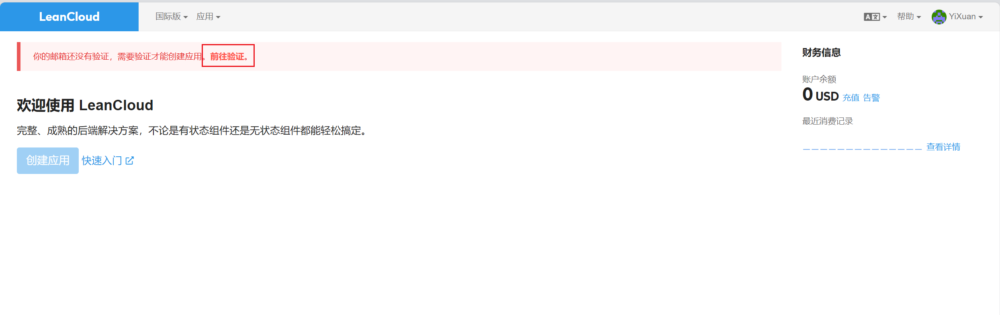

1. 打开邮箱，找到 LeanCloud 发送的验证邮件
2. 点击邮件中的验证链接
3. 验证成功后，即可登录控制台

### 1.4 登录控制台

验证邮箱后，使用注册的邮箱和密码登录 LeanCloud 控制台。

### 1.5 关于国内版（可选）

如果你需要使用国内版 LeanCloud，需要注意以下事项：

> ⚠️ **国内版需要完成备案接入**
>
> 如果你正在使用 Leancloud 国内版 ([leancloud.cn](https://leancloud.cn/))，我们推荐你切换到国际版 ([leancloud.app](https://leancloud.app/))。否则，你需要为应用额外绑定**已备案**的域名，同时购买独立 IP 并完成备案接入:
>
> - 登录国内版并进入需要使用的应用
> - 选择 `设置` > `域名绑定` > `API 访问域名` > `绑定新域名` > 输入域名 > `确定`。
> - 按照页面上的提示按要求在 DNS 上完成 CNAME 解析。
> - 购买独立 IP 并提交工单完成备案接入。(独立 IP 目前价格为 ￥ 50/个/月)


> 💡 **建议**：除非有特殊需求，否则使用国际版即可，配置更简单。

---

## 第二步：创建应用并获取凭证

### 2.1 创建新应用

1. 登录后，点击控制台首页的「创建应用」按钮
2. 填写应用信息：
   - **应用名称**：例如 `my-blog-comments`（建议使用有意义的名称）
   - **开发环境**：选择「开发版」（免费版）
   - **应用类型**：选择「Web 应用」
3. 点击「创建」完成应用创建

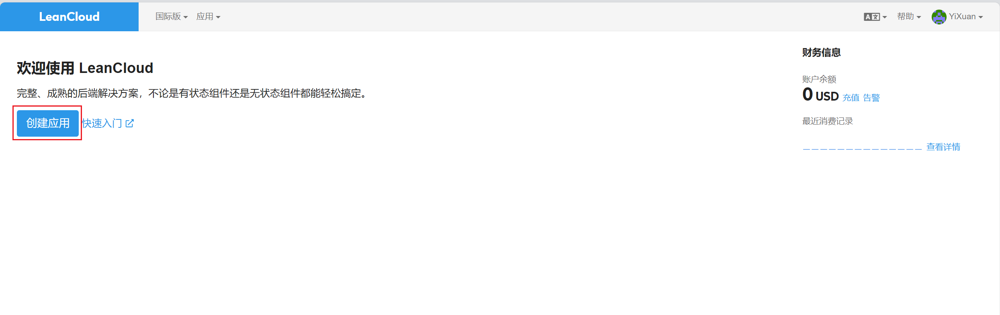

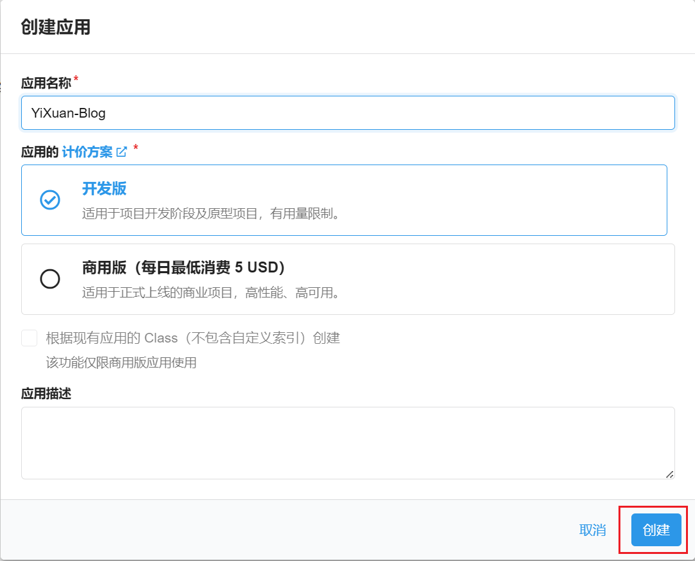

### 2.2 获取 App ID、App Key 和 Master Key

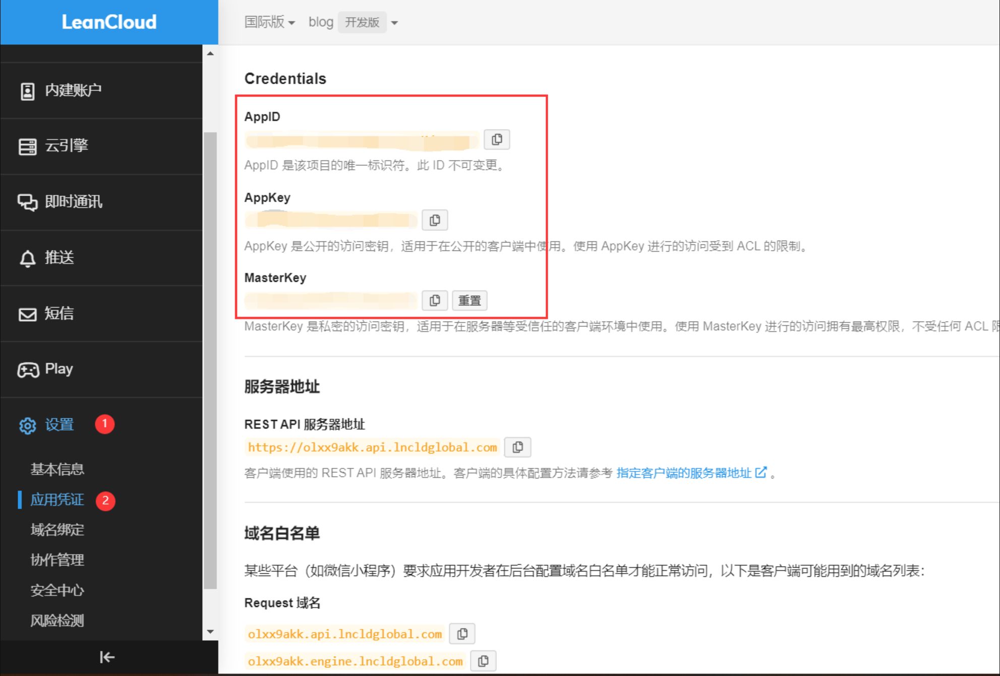

1. 在应用列表中，点击你刚创建的应用
2. 进入应用后，点击左侧菜单「设置」→「应用 Keys」
3. 在页面中可以看到：
   - **App ID**：例如 `xxxxxxxxxxxxxxxxxxxxxx`
   - **App Key**：例如 `xxxxxxxxxxxxxxxxxxxxxx`
   - **Master Key**：例如 `UKxxxxxxxxxxxxxxxxxxxxxx`（**请勿泄露**，仅在服务端使用）

> ⚠️ **重要**：请妥善保管你的 App ID、App Key 和 Master Key，不要泄露给他人。

### 2.3 记录凭证信息

将以下信息记录下来，后续配置会用到：

```
App ID: xxxxxxxxxxxxxxxxxxxxxx
App Key: xxxxxxxxxxxxxxxxxxxxxx
Master Key: UKxxxxxxxxxxxxxxxxxxxxxx
```

> 💡 **提示**：Master Key 用于 Vercel 环境变量配置，需要妥善保管。

---

## 第三步：部署 Waline 到 Vercel

### 3.1 什么是 Vercel

Vercel 是一个现代化的前端部署平台，提供免费的服务器托管服务，非常适合部署 Waline 服务端。

**Vercel 的优势：**
- ✅ 免费使用
- ✅ 自动 HTTPS
- ✅ 全球 CDN 加速
- ✅ 自动部署
- ✅ 环境变量管理

### 3.2 注册 Vercel 账号

1. 访问 Vercel 官网：https://vercel.com/
2. 点击「Sign Up」按钮
3. 使用 GitHub 账户进行快捷登录（推荐）

> 💡 **提示**：如果你未登录，Vercel 会让你注册或登录，请使用 GitHub 账户进行快捷登录。

### 3.3 一键部署 Waline

点击以下链接，跳转至 Vercel 进行 Server 端部署：

**[一键部署到 Vercel](https://vercel.com/new/clone?repository-url=https%3A%2F%2Fgithub.com%2Fwalinejs%2Fwaline%2Ftree%2Fmain%2Fexample)**

或者手动操作：

1. 访问 Vercel Dashboard
2. 点击「New Project」
3. 选择「Import Git Repository」
4. 输入 Waline 仓库地址：`https://github.com/walinejs/waline/tree/main/example`
5. 点击「Deploy」

### 3.4 等待部署完成

部署过程中，Vercel 会自动构建和部署项目：

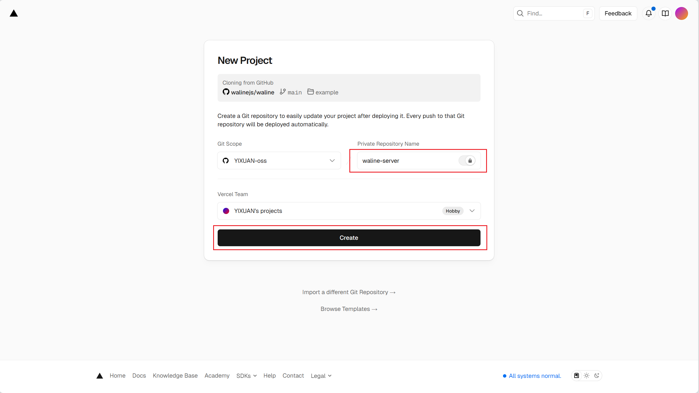

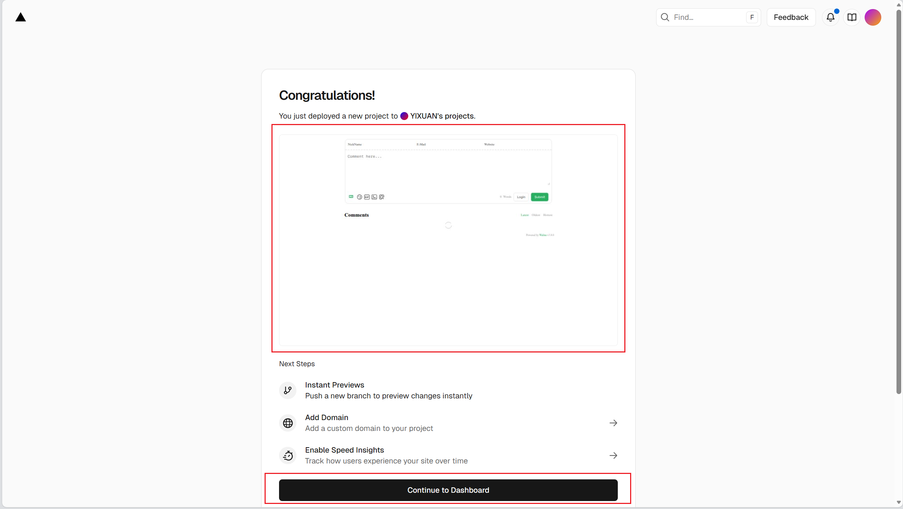

等待部署完成后，你会看到一个部署成功的页面。

### 3.5 验证部署成功

进入网站查看是否部署成功：


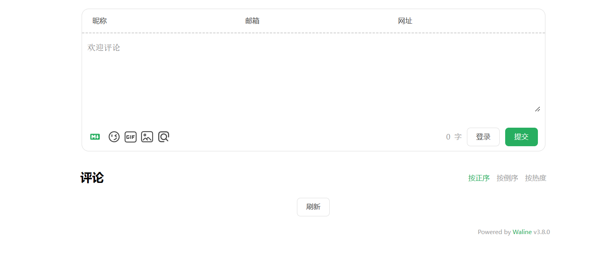

如果看到 Waline 的欢迎页面，说明部署成功。

### 3.6 配置环境变量

部署成功后，需要配置环境变量才能正常使用。进入 Vercel 项目设置：

1. 在 Vercel Dashboard 中找到你的项目
2. 点击项目进入详情页
3. 点击「Settings」→「Environment Variables」

#### 环境变量 1：LEAN_ID

- **Key**：`LEAN_ID`
- **Value**：你的 App ID（例如：`s1xxxxxxxxxxxxxxxxxxxxxx`）
- **Environments**：选择 `All Environments`（Production、Preview、Development）

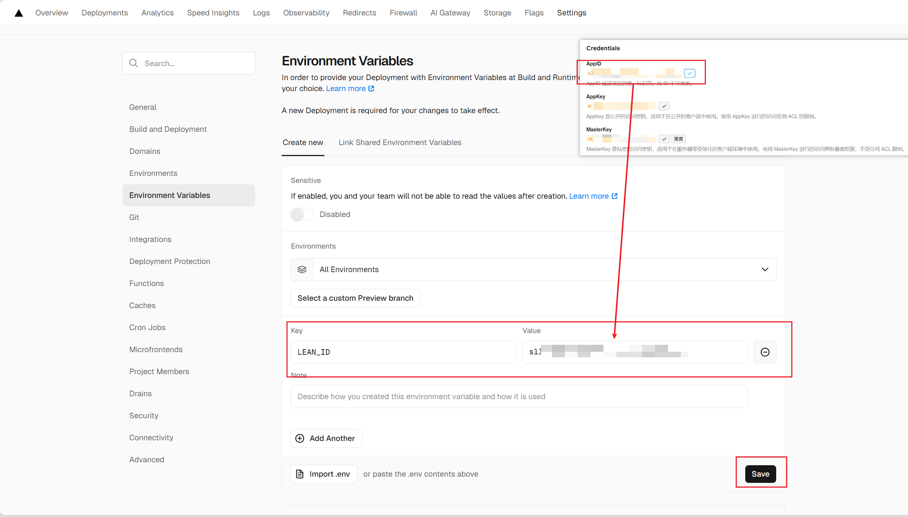

#### 环境变量 2：LEAN_KEY

- **Key**：`LEAN_KEY`
- **Value**：你的 App Key（例如：`m1xxxxxxxxxxxxxxxxxxxxxx`）
- **Environments**：选择 `All Environments`

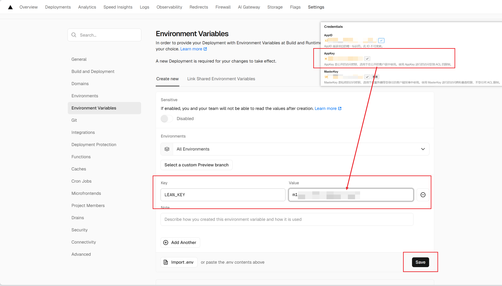

#### 环境变量 3：LEAN_MASTER_KEY

- **Key**：`LEAN_MASTER_KEY`
- **Value**：你的 Master Key（例如：`UKxxxxxxxxxxxxxxxxxxxxxx`）
- **Environments**：选择 `All Environments`
- **建议**：启用 `Sensitive` 选项（隐藏敏感值）

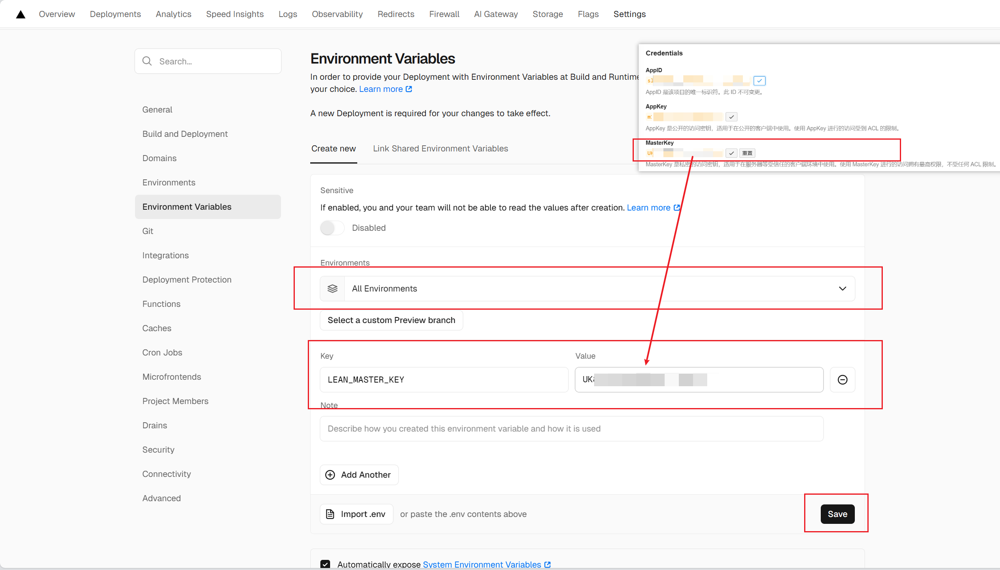

### 3.7 重新部署

配置完环境变量后，需要重新部署项目使配置生效：

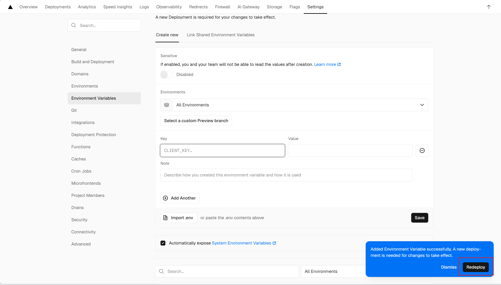

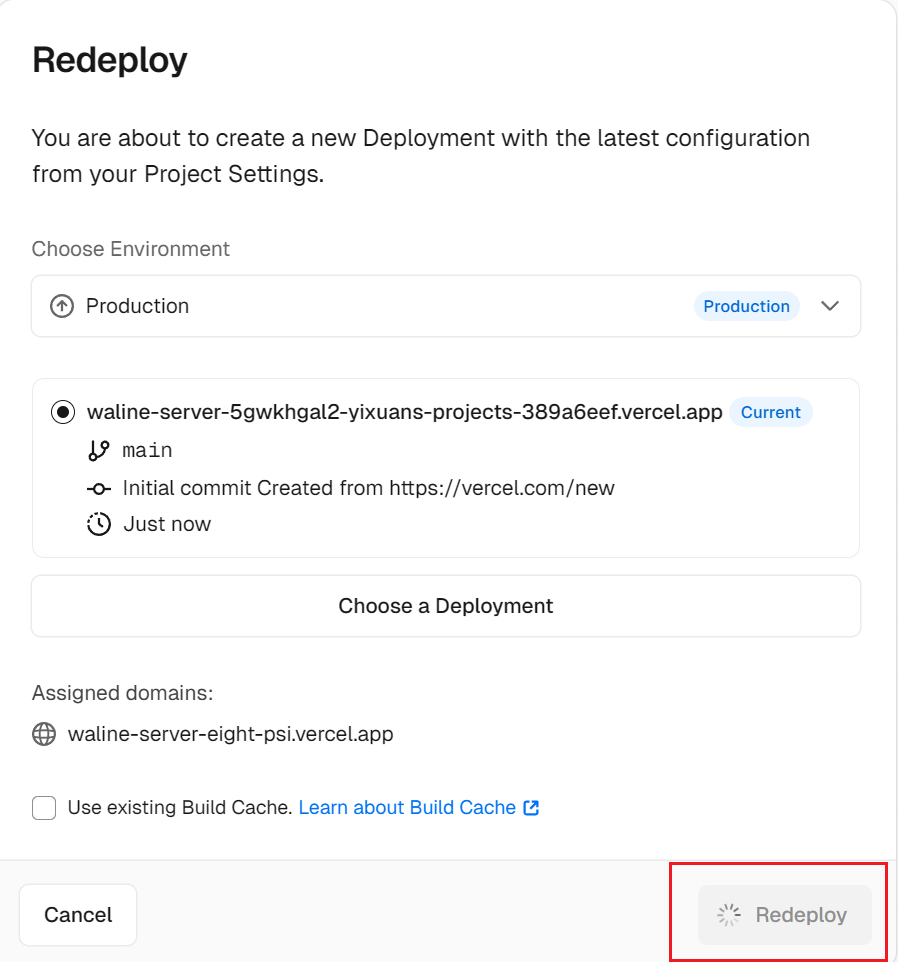

1. 点击「Deployments」标签
2. 找到最新的部署记录
3. 点击右侧的「⋯」菜单
4. 选择「Redeploy」
5. 确认重新部署

### 3.8 获取部署地址

重新部署完成后，你会得到一个 Waline 服务地址，格式如下：

```
https://your-project-name.vercel.app
```

这个地址就是你的 `serverURL`，后续配置博客时会用到。

> 💡 **提示**：记下这个地址，后续配置博客时需要用到。

---

## 第四步：配置博客

### 4.1 打开配置文件

打开 `docs/.vuepress/config.ts` 文件，找到评论配置部分（大约在第 267 行）。

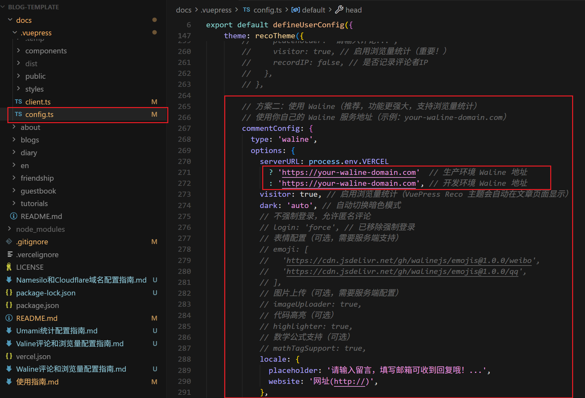

### 4.2 修改配置

找到被注释的 Waline 配置部分：

```typescript
// 方案二：使用 Waline（推荐，功能更强大，支持浏览量统计）
commentConfig: {
          type: 'waline',
          options: {
            serverURL: process.env.VERCEL 
              ? 'https://your-waline-domain.com'  // 生产环境 Waline 地址
              : 'https://your-waline-domain.com', // 开发环境 Waline 地址
            visitor: true, // 启用浏览量统计（VuePress Reco 主题会自动在文章页面显示）
            // ...
            locale: {
              placeholder: '请输入留言，填写邮箱可收到回复哦！...',
              website: '网址(http://)',
            },
          },
        },
```

### 4.3 取消注释并填写配置

将上面的注释取消，并替换为你的实际配置：

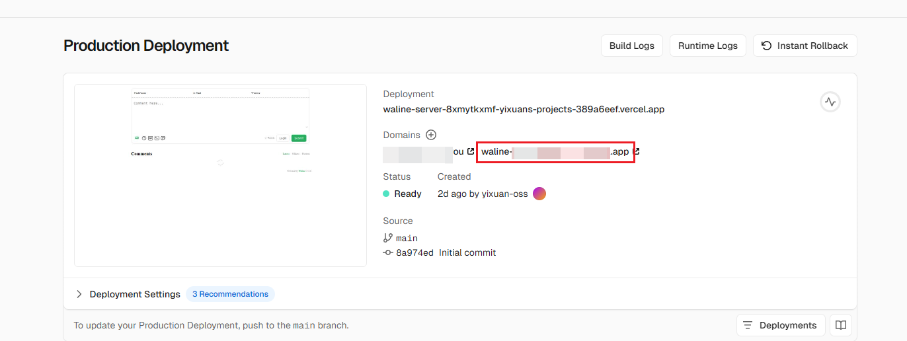

```typescript
// 方案二：使用 Waline（推荐，功能更强大，支持浏览量统计）
commentConfig: {
          type: 'waline',
          options: {
            serverURL: process.env.VERCEL 
              ? 'https://your-project-name.vercel.app'  // 生产环境 Waline 地址
              : 'https://your-project-name.vercel.app', // 开发环境 Waline 地址
            visitor: true, // 启用浏览量统计（VuePress Reco 主题会自动在文章页面显示）
            // ...
            locale: {
              placeholder: '请输入留言，填写邮箱可收到回复哦！...',
              website: '网址(http://)',
            },
          },
        },
```

### 4.4 禁用其他评论系统（如果已配置）

如果之前配置了 Valine 或其他评论系统，需要将其注释掉：

```typescript
// 方案一：使用 Valine（基于 LeanCloud，简单易用）
// commentConfig: {
//   type: 'valine',
//   options: {
//     appId: 'your-app-id',
//     appKey: 'your-app-key',
//     // ... 其他配置
//   },
// },
```

### 4.5 完整配置示例

以下是完整的 `commentConfig` 配置示例：

```typescript
theme: recoTheme({
  // ... 其他配置

  // 评论配置
  commentConfig: {
    type: 'waline',
    options: {
      // 必填：Waline 服务地址
      serverURL: process.env.VERCEL 
            ? 'https://your-project-name.vercel.app'  // 生产环境 Waline 地址
            : 'https://your-project-name.vercel.app', // 开发环境 Waline 地址
      
      // 可选：功能配置
      visitor: true,                // 启用浏览量统计（重要！）
      dark: 'auto',                 // 自动切换暗色模式：'auto' | 'light' | 'dark'
      
      // 可选：界面配置
      locale: {
        placeholder: '请输入留言，填写邮箱可收到回复哦！...', // 评论框占位提示
        website: '网址(http://)',   // 网址输入框提示
      },
      
      // 可选：评论功能配置
      requiredMeta: ['nick', 'mail'], // 必须填写的字段：['nick'] | ['nick', 'mail']
      wordLimit: [0, 1000],          // 评论字数限制：[最少字数, 最多字数]
      pageSize: 10,                  // 每页显示评论数
      
      // 可选：表情配置
      reaction: true,                // 启用表情反应
      emoji: [
        'https://cdn.jsdelivr.net/gh/walinejs/emojis@1.0.0/weibo',
        'https://cdn.jsdelivr.net/gh/walinejs/emojis@1.0.0/qq',
      ], // 自定义表情包
      
      // 可选：图片上传（需要服务端配置）
      // imageUploader: true,
      
      // 可选：代码高亮
      // highlighter: true,
      
      // 可选：数学公式支持
      // mathTagSupport: true,
    },
  },
})
```

### 4.6 实际配置示例

以下是一个实际可用的配置示例（请替换为你的实际 serverURL）：

```typescript
// 在 docs/.vuepress/config.ts 中
theme: recoTheme({
  // ... 其他配置
  
  commentConfig: {
    type: 'waline',
    options: {
      serverURL: 'https://waline-server-xxx.vercel.app', // 你的 Vercel 部署地址
      visitor: true,                    // ✅ 启用浏览量统计
      dark: 'auto',                     // 自动暗色模式
      locale: {
        placeholder: '请输入留言，填写邮箱可收到回复哦！...',
        website: '网址(http://)',
      },
      requiredMeta: ['nick', 'mail'],   // 必须填写昵称和邮箱
      pageSize: 10,                     // 每页显示 10 条评论
    },
  },
})
```

### 4.7 配置检查清单

配置完成后，请检查以下项目：

- [ ] serverURL 已正确填写（不是 `your-waline-domain.com`）
- [ ] serverURL 格式正确（以 `https://` 开头）
- [ ] `visitor: true` 已启用（如果需要浏览量统计）
- [ ] 其他评论系统已注释掉（如 Valine）
- [ ] 配置文件语法正确（没有缺少逗号或括号）

### 4.8 国内访问 Vercel 地址不能访问，解决方案

需要现有一个域名，详情请看：

在 Vercel 项目设置中添加自定义域名，配置 DNS 记录指向 Vercel 服务器。

> 📖 **详细配置步骤请查看：**[Namesilo + Cloudflare 域名配置指南](./Namesilo和Cloudflare域名配置指南.md) 
>
> 该指南步骤 5.3 配置主域名 有国内访问详细步骤。

接着将下述

```typescript
commentConfig: {
          type: 'waline',
          options: {
            serverURL: process.env.VERCEL 
              ? 'https://waline.yixuan.cyou'  // 你在[Namesilo + Cloudflare 域名配置指南]5.3 步骤中配置的域名
              : 'https://waline.yixuan.cyou', // 
            visitor: true, // 启用浏览量统计（VuePress Reco 主题会自动在文章页面显示）
            dark: 'auto', // 自动切换暗色模式
            // ...
            locale: {
              placeholder: '请输入留言，填写邮箱可收到回复哦！...',
              website: '网址(http://)',
            },
```


---

## 第五步：配置浏览量统计（模板中已默认启用）

Waline 支持浏览量统计功能，可以统计每篇文章的访问次数。配置浏览量统计需要以下步骤：

### 5.1 启用浏览量统计

在 `config.ts` 中，确保 `visitor: true` 已启用：

```typescript
commentConfig: {
  type: 'waline',
  options: {
    serverURL: 'https://your-project-name.vercel.app',
    visitor: true, // ✅ 启用浏览量统计（重要！）
    // ... 其他配置
  },
}
```

### 5.2 浏览量显示位置

启用 `visitor: true` 后，浏览量会在以下位置显示：

1. **文章详情页**：在文章标题下方或元信息中显示
2. **Waline 管理后台**：在管理后台可以看到浏览量数据
3. **LeanCloud 数据表**：在 `Counter` 表中存储浏览量数据

### 5.3 浏览量工作原理

- 每次访问文章页面时，Waline 会自动调用 API 增加浏览量计数
- 浏览量数据存储在 LeanCloud 的 `Counter` 数据表中
- 每个页面路径对应一个独立的浏览量计数

### 5.4 查看浏览量数据

#### 方法一：在 Waline 管理后台查看

1. 访问你的 Waline 管理后台：`https://your-project-name.vercel.app/ui`
2. 登录后，可以在后台看到浏览量统计

#### 方法二：在 LeanCloud 控制台查看

1. 登录 LeanCloud 控制台
2. 进入你的应用
3. 点击「数据存储」→「结构化数据」
4. 找到 `Counter` 表，可以看到：
   - `time`：浏览量数字
   - `url`：页面路径
   - `createdAt`：创建时间
   - `updatedAt`：更新时间

### 5.5 浏览量统计注意事项

- ⚠️ **刷新页面会增加浏览量**：每次刷新页面都会增加一次浏览量
- ⚠️ **免费版有限制**：LeanCloud 免费版每天有 30,000 次 API 调用限制
- 💡 **建议**：对于个人博客，免费版通常足够使用

### 5.6 自定义浏览量显示

如果需要自定义浏览量显示样式，可以在 `docs/.vuepress/styles/index.scss` 中添加：

```scss
// 自定义浏览量显示样式
.page-meta {
  .waline-visitor-count {
    color: #3eaf7c;
    font-weight: bold;
  }
}
```

---

## 第六步：验证配置

### 6.1 启动本地开发服务器

```bash
npm run dev
```

### 6.2 访问博客页面

1. 打开浏览器访问 `http://localhost:8080`
2. 导航到任意文章页面或留言板页面（`/guestbook/`）
3. 滚动到页面底部

### 6.3 检查评论框

如果配置正确，你应该能看到：

- ✅ Waline 评论框正常显示
- ✅ 评论框中有占位文字
- ✅ 可以输入昵称、邮箱、网址等信息
- ✅ 可以提交评论

### 6.4 测试评论功能

1. 在评论框中填写：
   - **昵称**：测试用户
   - **邮箱**：test@example.com（如果设置了 `requiredMeta: ['nick', 'mail']`）
   - **网址**：https://example.com（可选）
   - **评论内容**：这是一条测试评论
2. 点击「提交」按钮
3. 如果成功，评论会立即显示在评论列表中

### 6.5 验证 Waline 管理后台

1. 访问你的 Waline 管理后台：`https://your-project-name.vercel.app/ui`
2. 首次访问需要注册账号
3. 注册成功后，点击左上角「管理评论」
4. 你应该能看到刚才提交的测试评论

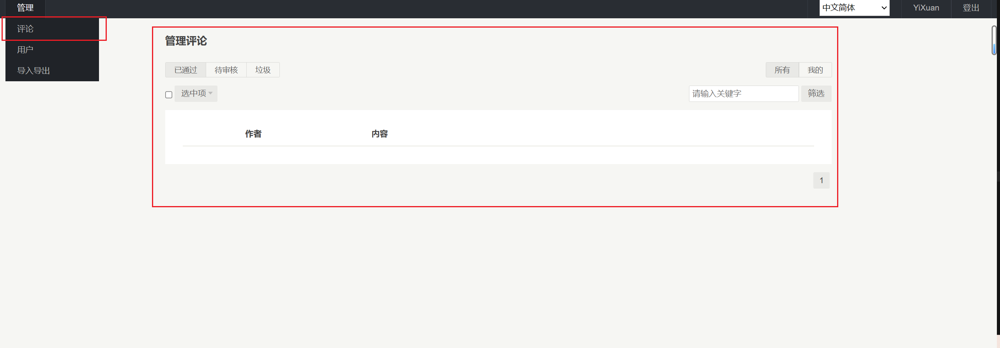

### 6.6 检查浏览量统计

如果启用了 `visitor: true`：

1. **刷新文章页面**：多次刷新同一篇文章页面
2. **查看浏览量显示**：在文章标题下方或元信息中应该能看到浏览量数字
3. **验证计数**：每次刷新页面，浏览量应该会增加
4. **检查数据表**：在 LeanCloud 控制台的 `Counter` 表中可以看到浏览量数据

> 💡 **提示**：如果浏览量不显示，请检查：
> - 配置中 `visitor: true` 是否已启用
> - LeanCloud 控制台的 `Counter` 表是否有数据
> - 浏览器控制台是否有错误信息

---

## 高级配置选项（参考）

### 表情反应配置

Waline 支持表情反应功能，可以增强用户互动：

```typescript
options: {
  reaction: true, // 启用表情反应
  // ... 其他配置
}
```

### 自定义表情包

可以配置自定义表情包：

```typescript
options: {
  emoji: [
    'https://cdn.jsdelivr.net/gh/walinejs/emojis@1.0.0/weibo',
    'https://cdn.jsdelivr.net/gh/walinejs/emojis@1.0.0/qq',
    'https://cdn.jsdelivr.net/gh/walinejs/emojis@1.0.0/bilibili',
  ], // 自定义表情包
  // ... 其他配置
}
```

### 评论审核配置

Waline 支持评论审核功能：

1. 访问 Waline 管理后台：`https://your-project-name.vercel.app/ui`
2. 在管理后台中可以审核、删除评论
3. 可以设置评论是否需要审核

### 邮件通知配置

如果需要接收新评论通知，需要在 Vercel 环境变量中配置：

1. 在 Vercel 项目设置中添加环境变量：
   - `SMTP_SERVICE`：邮件服务商（如 `qq`、`163`、`gmail`）
   - `SMTP_USER`：发件人邮箱
   - `SMTP_PASS`：邮箱授权码
   - `SITE_NAME`：网站名称
   - `SITE_URL`：网站地址
   - `AUTHOR_EMAIL`：接收通知的邮箱

2. 重新部署项目使配置生效

> 💡 **提示**：邮件通知配置需要邮箱授权码，不同邮箱服务商的获取方式不同。

### 图片上传配置

如果需要支持图片上传功能：

1. 在 Vercel 环境变量中配置图片存储服务（如 GitHub、阿里云 OSS 等）
2. 在 Waline 配置中启用图片上传：

```typescript
options: {
  imageUploader: true, // 启用图片上传
  // ... 其他配置
}
```

### 代码高亮配置

如果需要代码高亮功能：

```typescript
options: {
  highlighter: true, // 启用代码高亮
  // ... 其他配置
}
```

### 数学公式支持

如果需要 LaTeX 数学公式支持：

```typescript
options: {
  mathTagSupport: true, // 启用数学公式支持
  // ... 其他配置
}
```

### 自定义样式

如果需要自定义 Waline 评论框的样式，可以在 `docs/.vuepress/styles/index.scss` 中添加：

```scss
// Waline 评论框自定义样式
.waline-wrapper {
  .wl-editor {
    border-radius: 8px;
  }
  
  .wl-btn {
    background: #3eaf7c;
    border-radius: 4px;
  }
}
```

---

## 数据管理

### 查看评论数据

#### 方法一：在 Waline 管理后台查看

1. 访问 Waline 管理后台：`https://your-project-name.vercel.app/ui`
2. 登录后，点击「管理评论」
3. 可以看到所有评论数据，包括：
   - 评论内容
   - 评论者信息
   - 评论时间
   - 评论状态（已审核/待审核）

#### 方法二：在 LeanCloud 控制台查看

1. 登录 LeanCloud 控制台
2. 进入你的应用
3. 点击「数据存储」→「结构化数据」
4. 找到 `Comment` 表，可以看到所有评论数据

### 查看浏览量数据

1. 在「数据存储」→「结构化数据」中找到 `Counter` 表
2. 可以看到每个页面的浏览量数据
3. `time` 字段表示浏览量数字

### 导出数据

#### 在 Waline 管理后台导出

1. 访问 Waline 管理后台
2. 在管理界面中可以导出评论数据

#### 在 LeanCloud 控制台导出

1. 在数据表页面，点击「导出」按钮
2. 选择导出格式（CSV 或 JSON）
3. 下载数据文件

### 删除数据

> ⚠️ **警告**：删除操作不可恢复，请谨慎操作。

#### 在 Waline 管理后台删除

1. 访问 Waline 管理后台
2. 找到要删除的评论
3. 点击删除按钮
4. 确认删除操作

#### 在 LeanCloud 控制台删除

1. 在数据表中选择要删除的记录
2. 点击「删除」按钮
3. 确认删除操作

### 备份数据

建议定期备份评论和浏览量数据：

1. 定期导出 `Comment` 和 `Counter` 表的数据
2. 将数据文件保存到安全的位置
3. 建议每月备份一次

---

## 常见问题

### Q1: 评论框不显示

**可能原因：**
1. serverURL 配置错误
2. Vercel 部署失败
3. 环境变量未配置
4. 网络连接问题

**解决方案：**
1. 检查 `config.ts` 中的 `serverURL` 是否正确
2. 确认 Vercel 部署成功
3. 检查 Vercel 环境变量是否配置正确
4. 打开浏览器开发者工具（F12），查看 Console 是否有错误信息

### Q2: 提示「服务器连接失败」

**可能原因：**
1. Vercel 部署地址错误
2. Vercel 服务未正常运行
3. 环境变量配置错误

**解决方案：**
1. 检查 `serverURL` 是否正确（应该是 `https://your-project-name.vercel.app`）
2. 访问 Vercel Dashboard，检查部署状态
3. 检查 Vercel 环境变量是否配置正确（LEAN_ID、LEAN_KEY、LEAN_MASTER_KEY）

### Q3: 浏览量统计不显示

**可能原因：**
1. 未启用 `visitor: true`
2. 主题不支持浏览量显示
3. Vercel 服务未正常运行

**解决方案：**
1. 确认配置中 `visitor: true` 已启用
2. 检查主题是否支持浏览量统计功能
3. 查看 LeanCloud 控制台的 `Counter` 表是否有数据
4. 检查 Vercel 部署状态

### Q4: 评论提交失败

**可能原因：**
1. LeanCloud 免费版有请求限制
2. 网络连接问题
3. 环境变量配置错误
4. Vercel 服务异常

**解决方案：**
1. 检查 LeanCloud 控制台的「统计」→「API 调用统计」，查看是否超出限制
2. 检查网络连接
3. 查看浏览器 Console 的错误信息
4. 检查 Vercel 部署状态

### Q5: 无法访问管理后台

**可能原因：**
1. 管理后台地址错误
2. Vercel 部署失败

**解决方案：**
1. 管理后台地址格式：`https://your-project-name.vercel.app/ui`
2. 确认 Vercel 部署成功
3. 首次访问需要注册账号

### Q6: 免费版有什么限制

LeanCloud 免费版（开发版）的限制：

- **API 调用次数**：每天 30,000 次
- **数据存储**：2GB
- **文件存储**：2GB
- **不支持邮件通知**（需要配置 SMTP）

Vercel 免费版的限制：

- **函数执行时间**：10 秒
- **带宽**：100GB/月
- **构建时间**：45 分钟/月

对于个人博客来说，免费版通常足够使用。

### Q7: 浏览量统计不准确

**可能原因：**
1. 同一用户多次刷新页面
2. 爬虫访问导致浏览量增加
3. 浏览器缓存问题

**解决方案：**
1. 这是正常现象，浏览量统计的是页面访问次数，不是独立访客数
2. 如果需要更准确的统计，可以考虑使用其他统计工具（如 Google Analytics）

### Q8: 如何重置浏览量

如果需要重置某篇文章的浏览量：

1. 登录 LeanCloud 控制台
2. 进入「数据存储」→「结构化数据」
3. 找到 `Counter` 表
4. 找到对应的页面路径记录
5. 编辑记录，将 `time` 字段改为 0
6. 保存更改

### Q9: 邮件通知不工作

**可能原因：**
1. 未配置 SMTP 环境变量
2. 邮箱授权码错误
3. 邮件服务商限制

**解决方案：**
1. 检查 Vercel 环境变量是否配置正确（SMTP_SERVICE、SMTP_USER、SMTP_PASS 等）
2. 确认邮箱授权码正确（不是邮箱密码）
3. 重新部署 Vercel 项目使配置生效
4. 查看 Vercel 日志，检查是否有错误信息

### Q10: 如何防止垃圾评论

**建议措施：**
1. 在 Waline 管理后台设置评论审核
2. 配置 `requiredMeta: ['nick', 'mail']` 要求填写邮箱
3. 设置评论字数限制 `wordLimit: [0, 1000]`
4. 定期检查评论数据，手动删除垃圾评论
5. 在 Vercel 环境变量中配置 `DISABLE_REGION` 限制地区

### Q11: 配置后评论框显示空白

**可能原因：**
1. Waline CDN 加载失败
2. 网络连接问题
3. 浏览器插件拦截
4. serverURL 配置错误

**解决方案：**
1. 检查浏览器控制台是否有错误信息
2. 尝试禁用浏览器插件（如广告拦截器）
3. 检查网络连接，确保可以访问 Vercel
4. 确认 `serverURL` 配置正确
5. 尝试使用其他浏览器测试

### Q12: 浏览量数字不更新

**可能原因：**
1. 浏览器缓存问题
2. Vercel API 调用失败
3. 配置中 `visitor: true` 未启用
4. LeanCloud 环境变量配置错误

**解决方案：**
1. 清除浏览器缓存并刷新页面
2. 检查浏览器控制台是否有 API 错误
3. 确认配置中 `visitor: true` 已启用
4. 检查 LeanCloud 控制台的 `Counter` 表是否有新数据
5. 检查 Vercel 环境变量是否配置正确

### Q13: 如何查看 API 调用统计

#### LeanCloud API 调用统计

1. 登录 LeanCloud 控制台
2. 进入你的应用
3. 点击「统计」→「API 调用统计」
4. 可以查看：
   - 每日 API 调用次数
   - API 调用趋势
   - 各 API 端点的调用情况

#### Vercel 使用统计

1. 登录 Vercel Dashboard
2. 进入你的项目
3. 点击「Analytics」标签
4. 可以查看：
   - 函数调用次数
   - 带宽使用情况
   - 响应时间统计

> 💡 **提示**：免费版每天有 30,000 次 API 调用限制，注意监控使用量。

### Q14: 评论数据丢失怎么办

**预防措施：**
1. 定期备份评论数据（在 Waline 管理后台或 LeanCloud 控制台导出）
2. 定期备份浏览量数据（导出 `Counter` 表）
3. 建议每月备份一次

**恢复方法：**
1. 如果有备份，可以在 LeanCloud 控制台导入数据
2. 如果没有备份，数据无法恢复

> ⚠️ **警告**：请务必定期备份数据，避免数据丢失。

### Q15: Vercel 部署失败

**可能原因：**
1. 环境变量配置错误
2. 构建超时
3. 代码错误

**解决方案：**
1. 检查 Vercel 部署日志，查看错误信息
2. 确认环境变量配置正确（LEAN_ID、LEAN_KEY、LEAN_MASTER_KEY）
3. 检查构建日志，查看是否有代码错误
4. 尝试重新部署

### Q16: 如何迁移评论数据

如果需要从其他评论系统迁移到 Waline：

1. 导出原评论系统的数据
2. 按照 Waline 的数据格式转换
3. 在 LeanCloud 控制台的「数据存储」中手动导入

> 💡 **提示**：Waline 的数据格式请参考官方文档。

---

## 注意事项

### ⚠️ 安全建议

1. **不要泄露 Master Key**：Master Key 应该保密，不要提交到公开的代码仓库
2. **使用环境变量**：生产环境建议使用环境变量存储敏感信息
3. **定期更新**：定期更新 Waline 版本，修复安全漏洞
4. **限制访问**：在 Vercel 环境变量中配置访问限制（如 `DISABLE_REGION`）

### 💡 最佳实践

1. **使用环境变量**（推荐）：

在 Vercel 中配置环境变量，而不是直接写在代码中：

```typescript
// 在 config.ts 中
commentConfig: {
  type: 'waline',
  options: {
    serverURL: process.env.VERCEL 
      ? 'https://your-production-domain.vercel.app'  // 生产环境
      : 'https://your-production-domain.vercel.app', // 开发环境（也可以使用本地地址）
    // ... 其他配置
  },
}
```

2. **定期备份数据**：定期在 Waline 管理后台或 LeanCloud 控制台导出评论数据
3. **监控使用量**：定期查看 API 调用统计，避免超出免费额度
4. **配置评论审核**：启用评论审核功能，防止垃圾评论
5. **设置访问限制**：在 Vercel 环境变量中配置访问限制

### 📚 相关资源

- [Waline 官方文档](https://waline.js.org/)
- [Waline GitHub](https://github.com/walinejs/waline)
- [LeanCloud 官方文档](https://leancloud.cn/docs/)
- [Vercel 官方文档](https://vercel.com/docs)
- [VuePress Reco 主题文档](https://theme-reco.vuejs.press/)

---

## 总结

配置 Waline 评论和浏览量统计系统的完整流程：

### 快速检查清单

- [ ] 注册 LeanCloud 账号（国际版或国内版）
- [ ] 创建应用并获取 App ID、App Key 和 Master Key
- [ ] 注册 Vercel 账号（使用 GitHub 登录）
- [ ] 部署 Waline 到 Vercel
- [ ] 配置 Vercel 环境变量（LEAN_ID、LEAN_KEY、LEAN_MASTER_KEY）
- [ ] 重新部署 Vercel 项目
- [ ] 获取 Waline 服务地址（serverURL）
- [ ] 在 `config.ts` 中配置 Waline（填写 serverURL）
- [ ] 启用浏览量统计（设置 `visitor: true`）
- [ ] 禁用其他评论系统（如果已配置）
- [ ] 本地测试评论功能
- [ ] 验证浏览量统计是否正常
- [ ] 访问 Waline 管理后台注册账号
- [ ] 检查 LeanCloud 数据表是否有数据
- [ ] 部署到生产环境并再次验证

### 配置步骤总结

1. ✅ **注册 LeanCloud 账号**：选择国际版（推荐）或国内版
2. ✅ **创建应用**：创建新应用并获取 App ID、App Key 和 Master Key
3. ✅ **部署 Waline**：使用 Vercel 一键部署 Waline 服务端
4. ✅ **配置环境变量**：在 Vercel 中配置 LeanCloud 凭证
5. ✅ **配置博客**：在 `config.ts` 中填写 serverURL 等配置信息
6. ✅ **启用浏览量统计**：设置 `visitor: true`
7. ✅ **验证配置**：本地测试并验证功能正常
8. ✅ **管理后台**：访问管理后台注册账号并管理评论
9. ✅ **部署上线**：部署到生产环境并再次验证

### 重要提示

- ⚠️ **安全**：不要将 Master Key 提交到公开代码仓库
- ⚠️ **环境变量**：必须在 Vercel 中配置环境变量，否则无法正常工作
- 💡 **免费版限制**：注意 API 调用次数限制（每天 30,000 次）
- 💡 **定期备份**：建议定期导出评论和浏览量数据
- 💡 **管理后台**：首次访问管理后台需要注册账号

如果遇到问题，请参考「常见问题」部分或查看相关文档。

---

<div align="center">

## 🎉 配置完成！

**配置完成后，你的博客就可以使用 Waline 评论系统和浏览量统计功能了！**

### 📚 相关资源

- [Waline 官方文档](https://waline.js.org/)
- [Waline GitHub](https://github.com/walinejs/waline)
- [LeanCloud 官方文档](https://leancloud.cn/docs/)
- [Vercel 官方文档](https://vercel.com/docs)
- [VuePress Reco 主题文档](https://theme-reco.vuejs.press/)
- [项目 Issues](https://github.com/YIXUAN-oss/Blog-Template/issues)

### 💬 获取帮助

如有问题，欢迎通过以下方式获取帮助：

- 📧 提交 [Issue](https://github.com/YIXUAN-oss/Blog-Template/issues)
- 📖 查看 [使用指南.md](./使用指南.md)
- 🔍 搜索相关问题
- 📚 查看 [Waline 官方文档](https://waline.js.org/)

---

**祝你使用愉快！** ✨

</div>